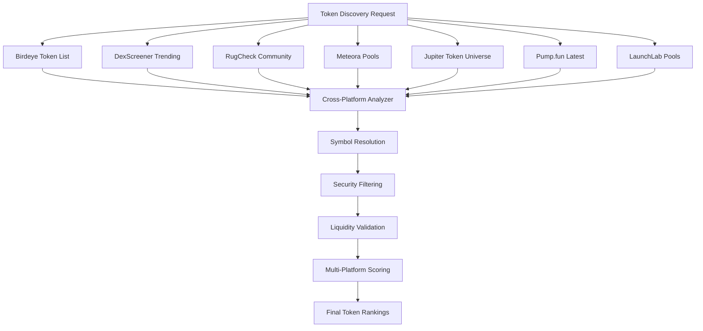

# 🚀 3-Hour Early Gem Detector - Comprehensive Documentation

## 📋 Table of Contents
1. [Overview](#overview)
2. [Architecture & Data Flow](#architecture--data-flow)
3. [API Data Fetching Methods](#api-data-fetching-methods)
4. [Configuration & Setup](#configuration--setup)
5. [Usage Instructions](#usage-instructions)
6. [Performance Optimizations](#performance-optimizations)
7. [Monitoring & Analytics](#monitoring--analytics)
8. [Troubleshooting](#troubleshooting)

---

## 🎯 Overview

The **3-Hour Early Gem Detector** is a sophisticated automated token discovery system that runs continuous scans every 20 minutes for 3 hours (9 total cycles). It's designed to identify high-potential early-stage tokens across multiple platforms with advanced scoring algorithms and real-time alerts.

### Key Features
- **🚀 Parallel Discovery**: Multi-platform token discovery with concurrent API calls
- **📊 Batch Processing**: 5-10x API call reduction through intelligent batching
- **🎯 Early Gem Focus**: Specialized scoring for ultra-early stage tokens
- **📱 Real-time Alerts**: Telegram notifications for high-conviction tokens
- **⚡ Performance Optimized**: 20-minute cycles with comprehensive analysis
- **🔍 Multi-Source Data**: Birdeye, Moralis, Pump.fun, LaunchLab integration

---

## 🏗️ Architecture & Data Flow

### System Components

```
┌─────────────────────────────────────────────────────────────┐
│                   3-Hour Detector                          │
├─────────────────────────────────────────────────────────────┤
│  ┌─────────────┐  ┌─────────────┐  ┌─────────────┐      │
│  │   Cycle 1   │  │   Cycle 2   │  │   Cycle 3   │      │
│  │  (20 min)   │  │  (20 min)   │  │  (20 min)   │      │
│  └─────────────┘  └─────────────┘  └─────────────┘      │
├─────────────────────────────────────────────────────────────┤
│  ┌─────────────┐  ┌─────────────┐  ┌─────────────┐      │
│  │   Cycle 4   │  │   Cycle 5   │  │   Cycle 6   │      │
│  │  (20 min)   │  │  (20 min)   │  │  (20 min)   │      │
│  └─────────────┘  └─────────────┘  └─────────────┘      │
├─────────────────────────────────────────────────────────────┤
│  ┌─────────────┐  ┌─────────────┐  ┌─────────────┐      │
│  │   Cycle 7   │  │   Cycle 8   │  │   Cycle 9   │      │
│  │  (20 min)   │  │  (20 min)   │  │  (20 min)   │      │
│  └─────────────┘  └─────────────┘  └─────────────┘      │
└─────────────────────────────────────────────────────────────┘
```

### Data Flow Architecture

```
┌─────────────────┐    ┌─────────────────┐    ┌─────────────────┐
│   API Sources   │    │  Data Processing │    │   Analysis &    │
│                 │    │                 │    │   Scoring       │
├─────────────────┤    ├─────────────────┤    ├─────────────────┤
│ • Birdeye API   │───▶│ • Token Discovery│───▶│ • Early Gem     │
│ • Moralis API   │    │ • Data Enrichment│   │   Scoring       │
│ • Pump.fun API  │    │ • Batch Processing│   │ • High Conviction│
│ • LaunchLab API │    │ • Deduplication │   │   Detection      │
└─────────────────┘    └─────────────────┘    └─────────────────┘
                                │                       │
                                ▼                       ▼
                       ┌─────────────────┐    ┌─────────────────┐
                       │   Performance   │    │   Alert System  │
                       │   Monitoring    │    │                 │
                       ├─────────────────┤    ├─────────────────┤
                       │ • API Usage     │    │ • Telegram      │
                       │ • Cost Tracking │    │   Alerts        │
                       │ • Batch Metrics │    │ • Dashboard     │
                       │ • Success Rates │    │ • Reports       │
                       └─────────────────┘    └─────────────────┘
```

---

## 🔍 API Data Fetching Methods

### 1. **Birdeye API Integration**

#### Endpoints Used
- **Base URL**: `https://public-api.birdeye.so`
- **Trending Tokens**: `/public/tokenlist?sort_by=v24hUSD&sort_type=desc`
- **Token Overview**: `/public/token_overview?address={address}`
- **OHLCV Data**: `/public/ohlcv?address={address}&timeframe={timeframe}`
- **Price Data**: `/public/price?address={address}`

#### Data Fetched
```python
# Trending tokens discovery
trending_tokens = await birdeye_api.get_trending_tokens()

# Token enrichment
token_data = {
    'symbol': 'TOKEN',
    'name': 'Token Name',
    'address': 'token_address',
    'price': 0.000123,
    'market_cap': 50000,
    'volume_24h': 25000,
    'price_change_24h': 15.5,
    'liquidity': 12000,
    'holders': 1500,
    'source': 'birdeye_trending'
}
```

#### Rate Limiting
- **Daily Limit**: 100,000 requests
- **Rate**: 10 requests/second
- **Cost**: ~$0.0001 per request

### 2. **Moralis API Integration**

#### Endpoints Used
- **Base URL**: `https://solana-gateway.moralis.io`
- **Bonding Tokens**: `/token/mainnet/exchange/pumpfun/bonding?limit=100`
- **Graduated Tokens**: `/token/mainnet/exchange/pumpfun/graduated?limit=50`

#### Data Fetched
```python
# Bonding curve tokens (pre-graduation)
bonding_tokens = await moralis_connector.get_bonding_tokens_by_exchange(
    exchange='pumpfun',
    limit=100,
    network='mainnet'
)

# Token data structure
token_data = {
    'tokenAddress': 'EQzpkp6w8ag3C5mGqr2cgSEXMEjdQ9q5r4o3KbHW8tB1',
    'symbol': 'MOONCAT',
    'name': 'Moon Cat Token',
    'priceNative': 0.000000015,  # Price in SOL
    'priceUsd': 0.000002025,     # Price in USD
    'liquidity': 5000,
    'fullyDilutedValuation': 2025,
    'bondingCurveProgress': 2.93  # Graduation percentage
}
```

#### Rate Limiting
- **Daily Limit**: 40,000 CU (Compute Units)
- **Bonding Request**: ~2 CU
- **Graduated Request**: ~2 CU

### 3. **Pump.fun API Integration**

#### Endpoints Used
- **Base URL**: `https://frontend-api.pump.fun`
- **Latest Tokens**: `/coins/latest`
- **Token Details**: `/coins/{address}`
- **Trades**: `/trades`

#### Data Fetched
```python
# Stage 0 tokens (ultra-early)
pump_fun_tokens = await pump_fun_api.get_latest_tokens(limit=30)

# Token data structure
token_data = {
    'mint_address': 'EQzpkp6w8ag3C5mGqr2cgSEXMEjdQ9q5r4o3KbHW8tB1',
    'symbol': 'MOONCAT',
    'name': 'Moon Cat Token',
    'creator_address': '7xKqR5mP8nQ2fV6wE3cH1dG4jL9sB2aF8iM3oN7pT4uX1zY6',
    'creation_timestamp': '2025-06-30T13:00:00Z',
    'current_price_usd': 0.000002025,
    'current_price_sol': 0.000000015,
    'market_cap_usd': 2025,
    'graduation_progress_pct': 2.93,
    'bonding_curve_stage': 'STAGE_0_ULTRA_EARLY',
    'sol_in_bonding_curve': 5.67,
    'graduation_threshold_usd': 69000
}
```

#### Fallback Strategy
- **Primary**: HTTP API calls
- **Fallback**: RPC monitoring when API is down (503 errors)
- **Enhanced**: WebSocket monitoring for real-time detection

### 4. **LaunchLab (Raydium) Integration**

#### Endpoints Used
- **Jupiter API**: `https://quote-api.jup.ag/v6/tokens`
- **Raydium API**: `https://api.raydium.io/v2/sdk/liquidity/mainnet.json`
- **Solana RPC**: `https://api.mainnet-beta.solana.com`

#### Data Fetched
```python
# SOL bonding curve tokens
launchlab_tokens = await sol_bonding_detector.get_sol_bonding_candidates(limit=20)

# Token data structure
token_data = {
    'address': 'EQzpkp6w8ag3C5mGqr2cgSEXMEjdQ9q5r4o3KbHW8tB1',
    'symbol': 'MOONCAT',
    'platform': 'raydium_launchlab',
    'launchlab_stage': 'LAUNCHLAB_EARLY_GROWTH',
    'sol_raised_estimated': 15.2,
    'graduation_progress_pct': 17.9,
    'graduation_threshold_sol': 85.0,
    'sol_remaining_for_graduation': 69.8,
    'profit_potential': '5-15x',
    'optimal_wallet': 'discovery_scout'
}
```

---

## ⚙️ Configuration & Setup

### Environment Variables

Create a `.env` file in the project root:

```bash
# API Keys
BIRDEYE_API_KEY=your_birdeye_api_key_here
MORALIS_API_KEY=your_moralis_api_key_here

# Telegram Alerts (Optional)
TELEGRAM_BOT_TOKEN=your_telegram_bot_token
TELEGRAM_CHAT_ID=your_telegram_chat_id

# Optional Settings
EARLY_DETECTION_LOG_LEVEL=INFO
ENABLE_PUMP_FUN_WEBSOCKET=false
```

### Configuration File

The system uses `config/config.yaml` for advanced settings:

```yaml
# Analysis Configuration
ANALYSIS:
  alert_score_threshold: 35.0
  high_conviction_threshold: 35.0
  batch_processing: true
  parallel_discovery: true

# API Configuration
BIRDEYE_API:
  api_key: ${BIRDEYE_API_KEY}
  base_url: https://public-api.birdeye.so
  timeout: 20
  rate_limit: 10

# SOL Bonding Configuration
SOL_BONDING:
  analysis_mode: heuristic
  graduation_threshold_sol: 85.0
  warning_threshold_sol: 75.0

# Performance Settings
PERFORMANCE:
  batch_size: 50
  max_concurrent_requests: 10
  cache_duration: 300
```

---

## 🚀 Usage Instructions

### Basic Usage

```bash
# Run 3-hour detector with default settings
python run_3hour_detector.py

# Run with debug mode
python run_3hour_detector.py --debug

# Run with dashboard
python run_3hour_detector.py --dashboard

# Run with compact dashboard
python run_3hour_detector.py --compact-dashboard

# Run with futuristic styled dashboard
python run_3hour_detector.py --futuristic-dashboard

# Run with futuristic compact dashboard
python run_3hour_detector.py --futuristic-compact
```

### Advanced Usage

```bash
# Run with all optimizations enabled
python run_3hour_detector.py --debug --futuristic-dashboard

# Run with custom configuration
CONFIG_PATH=config/config.optimized.yaml python run_3hour_detector.py

# Run with specific environment
ENABLE_PUMP_FUN_WEBSOCKET=true python run_3hour_detector.py
```

### Command Line Arguments

| Argument | Description | Default |
|----------|-------------|---------|
| `--debug` | Enable debug mode with verbose logging | False |
| `--dashboard` | Enable real-time dashboard | False |
| `--compact-dashboard` | Enable compact dashboard | False |
| `--futuristic-dashboard` | Enable futuristic styled dashboard | False |
| `--futuristic-compact` | Enable futuristic compact dashboard | False |

---

## ⚡ Performance Optimizations

### 1. **Batch API Processing**

The detector uses intelligent batching to reduce API calls by 5-10x:

```python
# Batch token enrichment
async def _batch_enrich_tokens(self, tokens: List[Dict[str, Any]]) -> List[Dict[str, Any]]:
    """Batch enrich tokens with comprehensive data"""
    token_addresses = [t['address'] for t in tokens]
    
    # Batch fetch price data
    price_data = await self.batch_manager.batch_multi_price(token_addresses)
    
    # Batch fetch token overviews
    token_overviews = await self.birdeye_api.batch_get_token_overviews(token_addresses)
    
    # Batch fetch OHLCV data
    ohlcv_data = await self._batch_fetch_short_timeframe_data(token_addresses)
    
    return enriched_tokens
```

### 2. **Parallel Discovery**

Multiple API sources are queried concurrently:

```python
# Parallel discovery tasks
discovery_tasks = [
    self._fetch_birdeye_trending_tokens(),
    self._fetch_moralis_graduated_tokens(),
    self._fetch_moralis_bonding_tokens(),
    self._discover_pump_fun_stage0(),
    self._discover_launchlab_early()
]

# Execute all tasks concurrently
results = await asyncio.gather(*discovery_tasks, return_exceptions=True)
```

### 3. **Tiered Analysis System**

Three-tier analysis to optimize resource usage:

```python
# Stage 1: Quick triage (FREE)
stage1_candidates = await self._quick_triage_candidates(enriched_candidates)

# Stage 2: Enhanced analysis (MEDIUM COST)
stage2_candidates = await self._enhanced_candidate_analysis(stage1_candidates)

# Stage 3: Deep analysis (HIGH COST)
stage3_candidates = await self._deep_analysis_top_candidates(stage2_candidates)
```

### 4. **Caching & Rate Limiting**

- **Enhanced Cache Manager**: Reduces duplicate API calls
- **Rate Limiter Service**: Prevents API rate limit violations
- **Session Stats**: Tracks API usage and costs

---

## 📊 Monitoring & Analytics

### Real-time Dashboard

The detector provides comprehensive real-time monitoring:

```
🚀 3-HOUR EARLY GEM DETECTOR - CYCLE 3/9
===========================================
⏰ Time: 2025-01-27 14:20:00
📊 Progress: 33.3% (3/9 cycles)

📡 API PERFORMANCE THIS CYCLE:
┌──────────┬──────┬─────────────┬─────────────┬─────────────┐
│ Platform │Calls │Success Rate │Avg Response │Batch Usage  │
├──────────┼──────┼─────────────┼─────────────┼─────────────┤
│ Birdeye  │ 45   │   95.6%     │   245ms     │   78.3%     │
│ Moralis  │ 12   │   91.7%     │   189ms     │   66.7%     │
│ Pump.fun │ 8    │   87.5%     │   312ms     │   50.0%     │
└──────────┴──────┴─────────────┴─────────────┴─────────────┘

🎯 HIGH CONVICTION TOKENS (3):
┌─────┬──────────┬──────┬─────────────┬──────────┬──────────┐
│Rank │ Symbol   │Score │Market Cap   │Source    │Platform  │
├─────┼──────────┼──────┼─────────────┼──────────┼──────────┤
│ 1.  │ MOONCAT  │ 78.5 │ $2,025      │pump.fun │pump.fun  │
│ 2.  │ ROCKET   │ 72.3 │ $1,850      │birdeye  │birdeye   │
│ 3.  │ GEM      │ 68.9 │ $1,650      │moralis  │moralis   │
└─────┴──────────┴──────┴─────────────┴──────────┴──────────┘

📈 Score Distribution: 🟢 High (3) | 🟡 Medium (12) | ⚪ Low (45)
```

### Session Statistics

Comprehensive session tracking:

```python
session_stats = {
    'start_time': datetime.now(),
    'cycles_completed': 3,
    'tokens_analyzed': 180,
    'high_conviction_found': 8,
    'alerts_sent': 5,
    'pump_fun_detections': 12,
    'sol_bonding_detections': 6,
    'api_usage_by_service': {
        'birdeye': {
            'total_calls': 135,
            'successful_calls': 129,
            'batch_calls': 106,
            'estimated_cost_usd': 0.0135
        },
        'moralis': {
            'total_calls': 36,
            'successful_calls': 33,
            'batch_calls': 24,
            'estimated_cost_usd': 0.0007
        }
    }
}
```

### Performance Metrics

- **API Efficiency**: Batch usage percentage
- **Success Rates**: API call success rates by platform
- **Cost Tracking**: Estimated API costs per session
- **Discovery Rates**: Tokens found per cycle
- **Alert Quality**: High conviction token detection rate

---

## 🔧 Troubleshooting

### Common Issues

#### 1. **API Rate Limit Errors**

**Symptoms**: 429 errors, API calls failing
**Solutions**:
```bash
# Check API usage
python scripts/analysis/quick_status.py

# Reduce batch size
export BATCH_SIZE=25

# Enable debug mode to see detailed API calls
python run_3hour_detector.py --debug
```

#### 2. **Pump.fun API 503 Errors**

**Symptoms**: Pump.fun integration returning empty results
**Solutions**:
```bash
# Enable RPC fallback
export ENABLE_PUMP_FUN_WEBSOCKET=true

# Check pump.fun API status
python scripts/tests/test_pump_fun_specific.py

# Use alternative data sources
export USE_DEXSCREENER_FALLBACK=true
```

#### 3. **Memory Issues**

**Symptoms**: High memory usage, slow performance
**Solutions**:
```bash
# Reduce cache size
export CACHE_SIZE=1000

# Enable garbage collection
export ENABLE_GC=true

# Monitor memory usage
python scripts/analysis/performance_monitor.py
```

#### 4. **Telegram Alert Failures**

**Symptoms**: No alerts being sent
**Solutions**:
```bash
# Check Telegram configuration
echo $TELEGRAM_BOT_TOKEN
echo $TELEGRAM_CHAT_ID

# Test Telegram connection
python scripts/tests/test_telegram_alerts.py

# Enable debug mode for alert logging
python run_3hour_detector.py --debug
```

### Debug Mode

Enable debug mode for detailed logging:

```bash
python run_3hour_detector.py --debug
```

Debug output includes:
- Detailed API call logs
- Token discovery breakdowns
- Scoring calculation details
- Performance metrics
- Error stack traces

### Log Files

Logs are stored in the `logs/` directory:
- `early_gem_detector.log`: Main detector logs
- `api_calls.log`: API call tracking
- `alerts.log`: Telegram alert logs
- `performance.log`: Performance metrics

---

## 📈 Expected Performance

### Typical Results (3-Hour Session)

| Metric | Expected Range | Optimal |
|--------|----------------|---------|
| **Cycles Completed** | 8-9 | 9 |
| **Tokens Analyzed** | 150-300 | 250+ |
| **High Conviction Found** | 5-15 | 10+ |
| **Alerts Sent** | 3-8 | 5+ |
| **API Calls** | 200-400 | 300 |
| **Batch Efficiency** | 60-80% | 75%+ |
| **Success Rate** | 85-95% | 90%+ |

### Cost Estimates

| API | Calls/Hour | Cost/Hour | Cost/Session |
|-----|------------|-----------|--------------|
| **Birdeye** | 15-25 | $0.0015-0.0025 | $0.0045-0.0075 |
| **Moralis** | 4-8 | $0.0002-0.0004 | $0.0006-0.0012 |
| **Pump.fun** | 2-4 | $0.0001-0.0002 | $0.0003-0.0006 |
| **Total** | 21-37 | $0.0018-0.0031 | $0.0054-0.0093 |

### Performance Benchmarks

- **Discovery Speed**: 50-100 tokens/minute
- **Analysis Speed**: 10-20 tokens/minute
- **Alert Latency**: <30 seconds
- **Memory Usage**: 100-200 MB
- **CPU Usage**: 10-20% (single core)

---

## 🔮 Future Enhancements

### Planned Improvements

1. **Enhanced AI Scoring**
   - Machine learning-based token analysis
   - Pattern recognition for pump detection
   - Sentiment analysis integration

2. **Advanced APIs**
   - Helius RPC integration
   - Solana Beach API
   - Additional DEX aggregators

3. **Real-time Features**
   - WebSocket price feeds
   - Live trade monitoring
   - Instant alert triggers

4. **Analytics Dashboard**
   - Historical performance tracking
   - ROI analysis
   - Portfolio simulation

---

## 🏗️ **SYSTEM ARCHITECTURE & FILE INTEGRATION GUIDE**

*For Junior Developers: This section explains how each file integrates into the 3-hour detector system*

### 📁 **File Structure & Integration Flow**

```
🚀 3-HOUR DETECTOR SYSTEM ARCHITECTURE
========================================

📂 Root Directory
├── 🚀 run_3hour_detector.py          # MAIN ENTRY POINT
├── 🎯 early_gem_detector.py          # CORE DETECTOR ENGINE
├── 📊 early_gem_focused_scoring.py   # SCORING SYSTEM
├── 🔍 enhanced_data_fetcher.py       # DATA ENHANCEMENT
├── 📊 dashboard_utils.py             # BASIC DASHBOARD
├── 🌌 dashboard_styled.py            # FUTURISTIC DASHBOARD
├── ⚙️ config/config.yaml             # CONFIGURATION
├── 🔑 .env                          # ENVIRONMENT VARIABLES
└── 📦 requirements.txt               # DEPENDENCIES

📂 api/ (API Integration Layer)
├── 🔌 birdeye_connector.py          # Birdeye API Integration
├── 🔌 moralis_connector.py          # Moralis API Integration
├── 💾 cache_manager.py              # API Caching System
└── ⚡ batch_api_manager.py          # Batch Processing

📂 services/ (Core Services)
├── 🚦 rate_limiter_service.py       # API Rate Limiting
├── 📱 telegram_alerter.py           # Alert System
├── 🔥 pump_fun_api_client.py       # Pump.fun Integration
└── 🚀 raydium_launchlab_api_client.py # LaunchLab Integration

📂 utils/ (Utility Modules)
├── 📝 logger_setup.py               # Logging Configuration
├── 🔧 env_loader.py                 # Environment Loading
└── ✅ config_validator.py           # Configuration Validation
```

### 🔄 **Integration Flow for Junior Developers**

#### **Step 1: Entry Point (`run_3hour_detector.py`)**
```python
# This is where everything starts - think of it as the "main()" function
# It's like the conductor of an orchestra, coordinating all other components

# What it does:
# 1. Parses command line arguments (--debug, --dashboard, etc.)
# 2. Sets up environment variables from .env file
# 3. Imports and initializes the core detector
# 4. Manages the 3-hour session loop (9 cycles)
# 5. Handles dashboard integration
# 6. Provides progress tracking and error handling
```

#### **Step 2: Core Detector (`early_gem_detector.py`)**
```python
# This is the "brain" of the system - contains all the detection logic
# Think of it as the main class that orchestrates everything

class EarlyGemDetector:
    def __init__(self):
        # 🔧 INTEGRATION POINT 1: API Connectors
        self.birdeye_api = BirdeyeAPI(...)           # From api/birdeye_connector.py
        self.moralis_connector = MoralisAPI(...)     # From api/moralis_connector.py
        self.cache_manager = EnhancedAPICacheManager() # From api/cache_manager.py
        
        # 🎯 INTEGRATION POINT 2: Scoring System
        self.early_gem_scorer = EarlyGemFocusedScoring(...) # From early_gem_focused_scoring.py
        
        # 📱 INTEGRATION POINT 3: Alert System
        self.telegram_alerter = TelegramAlerter(...) # From services/telegram_alerter.py
        
        # ⚙️ INTEGRATION POINT 4: Configuration
        self.config = self._load_config("config/config.yaml") # From config/config.yaml

    async def run_detection_cycle(self):
        # This method runs every 20 minutes for 3 hours
        # It's like the "heartbeat" of the system
        
        # 1. Discover tokens from multiple sources
        tokens = await self.discover_early_tokens()
        
        # 2. Enhance token data using enhanced_data_fetcher.py
        enhanced_tokens = await self._enrich_graduated_tokens(tokens)
        
        # 3. Analyze and score tokens using early_gem_focused_scoring.py
        analyzed_tokens = await self.analyze_early_candidates(enhanced_tokens)
        
        # 4. Send alerts for high-conviction tokens using telegram_alerter.py
        await self._send_early_gem_alert(high_conviction_tokens)
```

#### **Step 3: Data Enhancement (`enhanced_data_fetcher.py`)**
```python
# This file is like a "data aggregator" - it combines data from multiple sources
# Think of it as a smart data collector that knows where to get the best information

class EnhancedDataFetcher:
    async def enhance_token_with_comprehensive_data(self, token_address):
        # 🔍 STEP 1: Get primary data from DexScreener (FREE)
        dex_data = await self._fetch_dexscreener_data(token_address)
        
        # 🚀 STEP 2: Get enhancements from Birdeye (PAID API)
        birdeye_data = await self._fetch_birdeye_enhancements(token_address)
        
        # 🔄 STEP 3: Merge data intelligently
        merged_data = self._merge_data_sources(dex_data, birdeye_data)
        
        # 📊 STEP 4: Calculate derived metrics
        final_data = self._calculate_derived_metrics(merged_data)
        
        return final_data

# INTEGRATION: This is called by early_gem_detector.py during token analysis
# Purpose: Transform basic token data into comprehensive analysis-ready data
```

#### **Step 4: Scoring System (`early_gem_focused_scoring.py`)**
```python
# This file contains the "intelligence" - it decides how good each token is
# Think of it as the "grading system" that scores tokens from 0-100

class EarlyGemFocusedScoring:
    def calculate_final_score(self, candidate, overview_data, ...):
        # 🎯 EARLY PLATFORM SCORE (40% weight)
        # Checks if token is from Pump.fun, LaunchLab, etc.
        early_platform_score = self._calculate_early_platform_score(candidate)
        
        # 📈 MOMENTUM SIGNALS (30% weight)
        # Analyzes volume, price changes, trading activity
        momentum_score = self._calculate_momentum_signals(candidate)
        
        # 🛡️ SAFETY VALIDATION (20% weight)
        # Checks for scams, security risks
        safety_score = self._calculate_safety_validation(candidate)
        
        # ✅ CROSS-PLATFORM BONUS (10% weight)
        # Bonus for tokens found on multiple platforms
        validation_bonus = self._calculate_validation_bonus(candidate)
        
        # 🎯 FINAL SCORE CALCULATION
        final_score = (early_platform_score * 0.4 + 
                      momentum_score * 0.3 + 
                      safety_score * 0.2 + 
                      validation_bonus * 0.1)
        
        return final_score

# INTEGRATION: This is called by early_gem_detector.py for each token
# Purpose: Convert raw token data into a numerical score (0-100)
```

#### **Step 5: API Integration Layer (`api/` directory)**
```python
# These files handle communication with external APIs
# Think of them as "translators" that speak the language of each API

# 🔌 api/birdeye_connector.py
class BirdeyeAPI:
    async def get_trending_tokens(self):
        # Makes HTTP request to Birdeye API
        # Returns list of trending token addresses
        # Used by: early_gem_detector.py for token discovery
    
    async def get_token_overview(self, address):
        # Gets detailed token information
        # Used by: enhanced_data_fetcher.py for data enhancement

# 🔌 api/moralis_connector.py
class MoralisAPI:
    async def get_bonding_tokens_by_exchange(self, exchange='pumpfun'):
        # Gets tokens from Pump.fun bonding curve
        # Used by: early_gem_detector.py for early-stage detection

# 💾 api/cache_manager.py
class EnhancedAPICacheManager:
    def get_cached_data(self, key):
        # Prevents duplicate API calls
        # Used by: All API connectors to save costs

# ⚡ api/batch_api_manager.py
class BatchAPIManager:
    async def batch_get_token_overviews(self, addresses):
        # Makes multiple API calls at once
        # Used by: early_gem_detector.py for efficiency
```

#### **Step 6: Services Layer (`services/` directory)**
```python
# These files provide core system services
# Think of them as "utilities" that the main system needs

# 🚦 services/rate_limiter_service.py
class RateLimiterService:
    async def wait_if_needed(self, api_name):
        # Prevents hitting API rate limits
        # Used by: All API connectors

# 📱 services/telegram_alerter.py
class TelegramAlerter:
    async def send_alert(self, token_data):
        # Sends Telegram messages for high-conviction tokens
        # Used by: early_gem_detector.py when good tokens are found

# 🔥 services/pump_fun_api_client.py
class PumpFunAPIClient:
    async def get_latest_tokens(self):
        # Gets tokens from Pump.fun platform
        # Used by: early_gem_detector.py for ultra-early detection

# 🚀 services/raydium_launchlab_api_client.py
class RaydiumLaunchLabAPIClient:
    async def get_sol_bonding_candidates(self):
        # Gets SOL bonding curve tokens
        # Used by: early_gem_detector.py for LaunchLab detection
```

#### **Step 7: Dashboard Integration (`dashboard_*.py`)**
```python
# These files provide real-time visualization
# Think of them as "monitors" that show what's happening

# 📊 dashboard_utils.py (Basic Dashboard)
class BasicDashboard:
    def add_cycle_data(self, cycle_number, result, detector):
        # Stores data from each detection cycle
        # Used by: run_3hour_detector.py for progress tracking
    
    def display_dashboard(self, cycle_number, total_cycles):
        # Shows real-time progress and metrics
        # Called by: run_3hour_detector.py after each cycle

# 🌌 dashboard_styled.py (Futuristic Dashboard)
class StyledDashboard:
    def display_futuristic_dashboard(self, cycle_number, total_cycles):
        # Shows advanced visualizations with neon effects
        # Used when --futuristic-dashboard flag is enabled
```

#### **Step 8: Configuration & Environment**
```python
# These files control how the system behaves
# Think of them as "settings" that customize the system

# ⚙️ config/config.yaml
ANALYSIS:
  alert_score_threshold: 35.0  # Minimum score to send alerts
  batch_processing: true       # Enable batch API calls
  parallel_discovery: true     # Enable parallel token discovery

BIRDEYE_API:
  api_key: ${BIRDEYE_API_KEY}  # API key from environment
  base_url: https://public-api.birdeye.so
  timeout: 20

# 🔑 .env file
BIRDEYE_API_KEY=your_birdeye_api_key_here
MORALIS_API_KEY=your_moralis_api_key_here
TELEGRAM_BOT_TOKEN=your_telegram_bot_token
TELEGRAM_CHAT_ID=your_telegram_chat_id
```

### 🔄 **Data Flow for Junior Developers**

```
1. 🚀 START: run_3hour_detector.py
   ↓
2. 🎯 INITIALIZE: early_gem_detector.py
   ↓
3. 🔍 DISCOVER: API connectors fetch tokens
   ↓
4. 📊 ENHANCE: enhanced_data_fetcher.py enriches data
   ↓
5. 🎯 ANALYZE: early_gem_focused_scoring.py scores tokens
   ↓
6. 📱 ALERT: telegram_alerter.py sends notifications
   ↓
7. 📊 DISPLAY: dashboard_*.py shows progress
   ↓
8. 🔄 REPEAT: Steps 3-7 every 20 minutes for 3 hours
```

### 🎯 **Key Integration Points for Junior Developers**

#### **1. Main Entry Point**
```python
# File: run_3hour_detector.py
# Purpose: Orchestrates the entire 3-hour session
# Integration: Imports and uses early_gem_detector.py

from early_gem_detector import EarlyGemDetector
detector = EarlyGemDetector(debug_mode=debug_mode)
result = await detector.run_detection_cycle()
```

#### **2. Core Detection Logic**
```python
# File: early_gem_detector.py
# Purpose: Contains all the detection and analysis logic
# Integration: Uses multiple API connectors and scoring systems

# API Integration
from api.birdeye_connector import BirdeyeAPI
from api.moralis_connector import MoralisAPI

# Scoring Integration
from early_gem_focused_scoring import EarlyGemFocusedScoring

# Data Enhancement Integration
from enhanced_data_fetcher import EnhancedDataFetcher
```

#### **3. Data Enhancement Pipeline**
```python
# File: enhanced_data_fetcher.py
# Purpose: Combines data from multiple sources
# Integration: Called by early_gem_detector.py during analysis

# Called like this:
enhanced_data = await self._enhance_token_with_trading_data(token_data, token_address)
```

#### **4. Scoring System**
```python
# File: early_gem_focused_scoring.py
# Purpose: Converts token data into numerical scores
# Integration: Called by early_gem_detector.py for each token

# Called like this:
final_score, scoring_breakdown = self.early_gem_scorer.calculate_final_score(
    candidate, overview_data, whale_analysis, ...
)
```

#### **5. Dashboard Integration**
```python
# File: dashboard_utils.py / dashboard_styled.py
# Purpose: Provides real-time visualization
# Integration: Called by run_3hour_detector.py after each cycle

# Called like this:
dashboard.add_cycle_data(cycle_number, result, detector)
dashboard.display_dashboard(cycle_number, total_cycles)
```

### 🚨 **Common Integration Issues for Junior Developers**

#### **1. Import Errors**
```python
# ❌ Common Mistake: Wrong import path
from early_gem_detector import EarlyGemDetector  # This might fail

# ✅ Solution: Check file structure and use correct paths
import sys
sys.path.append(os.getcwd())
from early_gem_detector import EarlyGemDetector
```

#### **2. Configuration Issues**
```python
# ❌ Common Mistake: Missing environment variables
# The system needs API keys to work

# ✅ Solution: Create .env file with required keys
BIRDEYE_API_KEY=your_key_here
MORALIS_API_KEY=your_key_here
```

#### **3. API Rate Limiting**
```python
# ❌ Common Mistake: Too many API calls
# APIs have rate limits that can cause failures

# ✅ Solution: Use batch processing and caching
# The system automatically handles this via batch_api_manager.py
```

#### **4. Dashboard Not Showing**
```python
# ❌ Common Mistake: Dashboard files missing
# Dashboard is optional and might not be available

# ✅ Solution: Check if dashboard files exist
try:
    from dashboard_utils import create_dashboard
    DASHBOARD_AVAILABLE = True
except ImportError:
    DASHBOARD_AVAILABLE = False
```

### 📚 **Learning Path for Junior Developers**

1. **Start with**: `run_3hour_detector.py` - Understand the main flow
2. **Study**: `early_gem_detector.py` - Learn the core detection logic
3. **Explore**: `enhanced_data_fetcher.py` - Understand data aggregation
4. **Analyze**: `early_gem_focused_scoring.py` - Learn scoring algorithms
5. **Review**: `api/` directory - Understand API integrations
6. **Customize**: `config/config.yaml` - Learn configuration options

---

## 🔌 **Complete API Endpoints Reference**

### 📊 **API Integration Overview**

The 3-hour detector integrates **7 major data platforms** with **25+ distinct endpoints** to provide comprehensive token discovery and analysis:

| Platform | Base URL | Primary Purpose | Endpoints | Rate Limits | Authentication |
|----------|----------|-----------------|-----------|-------------|----------------|
| **Birdeye** | `https://public-api.birdeye.so` | Comprehensive token analysis & trending | 8 endpoints | 100 RPM (free) | API Key required |
| **DexScreener** | `https://api.dexscreener.com` | Social validation & promotional tracking | 6 endpoints | ~300 RPM (estimated) | None |
| **RugCheck** | `https://api.rugcheck.xyz` | Security analysis & community validation | 3 endpoints | 120 RPH (2 RPS) | None |
| **Jupiter** | `https://quote-api.jup.ag` + `https://token.jup.ag` | Liquidity analysis & token universe | 2 endpoints | 60 RPM (free) | Optional |
| **Meteora** | `https://universal-search-api.meteora.ag` | DEX pool volume analysis | 1 endpoint | ~60 RPM (estimated) | None |
| **Pump.fun** | `https://frontend-api.pump.fun` | Stage 0 token discovery | 3 endpoints | 1 RPS (conservative) | None |
| **LaunchLab** | `https://api.raydium.io` | SOL bonding curve analysis | 3 endpoints | 0.5 RPS (conservative) | None |

---

### 🐦 **1. Birdeye Platform (8 Endpoints)**

**Base URL**: `https://public-api.birdeye.so`  
**Purpose**: Primary token analysis and trending detection  
**Authentication**: API Key required (`X-API-KEY` header)  
**Rate Limits**: 100 requests/minute (free tier), 30 RPM for wallet endpoints

#### **1.1 Token Discovery Endpoints**

##### `/defi/v3/token/list`
- **Purpose**: Primary token discovery with advanced filtering
- **Method**: GET
- **Headers**: `X-API-KEY`, `x-chain: solana`
- **Key Parameters**:
  ```json
  {
    "chain": "solana",
    "limit": 100,
    "sort_by": "volume_1h_change_percent|last_trade_unix_time|fdv|liquidity",
    "sort_type": "desc",
    "min_liquidity": 1000000,
    "min_volume_24h_usd": 100000
  }
  ```
- **Response Fields Used**:
  - `address`, `symbol`, `liquidity`, `market_cap`, `holder`
  - `volume_Xh_usd` (1h, 2h, 4h, 8h, 24h)
  - `price_change_Xh_percent`, `trade_Xh_count`
- **Usage**: Primary token discovery and filtering

##### `/defi/v3/token/trending`
- **Purpose**: Trending tokens with momentum analysis
- **Method**: GET
- **Headers**: `X-API-KEY`, `x-chain: solana`
- **Response Fields Used**:
  - `address`, `symbol`, `trending_score`
  - `volume_change_24h_percent`, `price_change_24h_percent`
- **Usage**: Momentum-based token discovery

#### **1.2 Token Analysis Endpoints**

##### `/defi/v3/token/overview`
- **Purpose**: Comprehensive token overview and metadata
- **Method**: GET
- **Headers**: `X-API-KEY`, `x-chain: solana`
- **Parameters**: `address` (token address)
- **Response Fields Used**:
  - `address`, `symbol`, `name`, `decimals`, `logo`
  - `price_usd`, `price_sol`, `market_cap`, `fdv`
  - `liquidity`, `volume_24h_usd`, `holder`
- **Usage**: Token metadata and basic market data

##### `/defi/v3/token/market-data`
- **Purpose**: Detailed market data and trading metrics
- **Method**: GET
- **Headers**: `X-API-KEY`, `x-chain: solana`
- **Parameters**: `address`, `timeframe` (1h, 4h, 24h)
- **Response Fields Used**:
  - `price_usd`, `price_sol`, `volume_usd`, `market_cap`
  - `price_change_percent`, `volume_change_percent`
  - `high_24h`, `low_24h`, `open_24h`
- **Usage**: Real-time market data analysis

#### **1.3 Transaction Analysis Endpoints**

##### `/defi/txs/token`
- **Purpose**: Token transaction history and trade analysis
- **Method**: GET
- **Headers**: `X-API-KEY`, `x-chain: solana`
- **Parameters**:
  ```json
  {
    "address": "token_address",
    "offset": 0,
    "limit": 50,
    "tx_type": "swap",
    "sort_type": "desc",
    "from_time": 1234567890,
    "to_time": 1234567890
  }
  ```
- **Response Fields Used**:
  - `blockUnixTime`, `side` (buy/sell), `volume_usd`
  - `from`, `to` (wallet addresses)
  - `quote`, `base` (token amounts and prices)
- **Usage**: Trade analysis and smart money detection

##### `/defi/v3/token-activity`
- **Purpose**: Alternative transaction endpoint (fallback)
- **Method**: GET
- **Headers**: `X-API-KEY`, `x-chain: solana`
- **Parameters**: `address`, `offset`, `limit`, `fromTime`, `toTime`
- **Usage**: Fallback for transaction data when primary endpoint fails

#### **1.4 Wallet Analysis Endpoints**

##### `/v1/wallet/token-list`
- **Purpose**: Wallet token holdings analysis
- **Method**: GET
- **Headers**: `X-API-KEY`, `x-chain: solana`
- **Parameters**: `wallet` (wallet address)
- **Response Fields Used**:
  - `address`, `symbol`, `balance`, `value_usd`
  - `price_usd`, `price_change_24h_percent`
- **Usage**: Smart money wallet analysis (30 RPM limit)

##### `/v1/wallet/tx-list`
- **Purpose**: Wallet transaction history
- **Method**: GET
- **Headers**: `X-API-KEY`, `x-chain: solana`
- **Parameters**: `wallet`, `offset`, `limit`
- **Response Fields Used**:
  - `blockUnixTime`, `side`, `volume_usd`
  - `from`, `to`, `token_address`
- **Usage**: Smart money transaction tracking (30 RPM limit)

---

### 🔍 **2. DexScreener Platform (6 Endpoints)**

**Base URL**: `https://api.dexscreener.com`  
**Purpose**: Social validation and promotional tracking  
**Authentication**: None required  
**Rate Limits**: ~300 RPM (estimated)

#### **2.1 Token Discovery Endpoints**

##### `/latest/dex/tokens/{address}`
- **Purpose**: Token information and social data
- **Method**: GET
- **Parameters**: `address` (in URL path)
- **Response Fields Used**:
  - `address`, `symbol`, `name`, `decimals`
  - `priceUsd`, `priceChange24h`, `volume24h`
  - `liquidity`, `fdv`, `marketCap`
- **Usage**: Token validation and social metrics

##### `/latest/dex/search`
- **Purpose**: Token search and discovery
- **Method**: GET
- **Parameters**: `q` (search query)
- **Response Fields Used**:
  - `pairs` array with token data
  - `address`, `symbol`, `priceUsd`, `volume24h`
- **Usage**: Token discovery by symbol or address

#### **2.2 Social Analysis Endpoints**

##### `/latest/dex/tokens/{address}/info`
- **Purpose**: Token profile and social data
- **Method**: GET
- **Response Fields Used**:
  - `description`, `website`, `twitter`, `telegram`
  - `social_score`, `narrative_strength`
- **Usage**: Social validation scoring

##### `/latest/dex/tokens/boosted`
- **Purpose**: Promoted/paid token listings
- **Method**: GET
- **Response Fields Used**: Standard token data + promotion metrics
- **Usage**: Identifies tokens with marketing investment

#### **2.3 Trending Analysis Endpoints**

##### `/latest/dex/pairs/solana`
- **Purpose**: Solana DEX pairs with volume data
- **Method**: GET
- **Response Fields Used**:
  - `pairs` array with trading data
  - `address`, `symbol`, `priceUsd`, `volume24h`
  - `liquidity`, `fdv`, `marketCap`
- **Usage**: Volume-based token discovery

##### `/latest/dex/tokens/trending`
- **Purpose**: Trending tokens across all DEXs
- **Method**: GET
- **Response Fields Used**:
  - `tokens` array with trending data
  - `address`, `symbol`, `trending_score`
  - `volume_change_24h`, `price_change_24h`
- **Usage**: Cross-DEX trending analysis

---

### 🛡️ **3. RugCheck Platform (3 Endpoints)**

**Base URL**: `https://api.rugcheck.xyz`  
**Purpose**: Token security analysis and risk assessment  
**Authentication**: None required  
**Rate Limits**: 2 requests/second (conservative)

#### **3.1 Security Analysis Endpoints**

##### `/v1/tokens/{address}/report`
- **Purpose**: Comprehensive security report
- **Method**: GET
- **Response Fields Used**:
  - `is_scam`, `is_risky`, `security_score`
  - `holder_distribution`, `top_holders`
  - `mint_authority`, `freeze_authority`, `creator_address`
- **Usage**: Deep security analysis for high-value tokens

##### `/v1/tokens/{address}/summary`
- **Purpose**: Basic security summary
- **Method**: GET
- **Response Fields Used**:
  - `risk_level`, `safety_score`, `quick_flags`
- **Usage**: Fast security screening

#### **3.2 Community Validation**

##### `/v1/tokens/{chain}/trending`
- **Purpose**: Community-validated trending tokens
- **Method**: GET
- **Key Parameters**:
  - `chain=solana`
- **Response Fields Used**:
  - `address`, `symbol`, `vote_count`, `sentiment_score`
- **Usage**: Community sentiment analysis (exactly 10 tokens)

---

### 🪐 **4. Jupiter Platform (2 Endpoints)**

**Base URL**: Multiple domains  
**Purpose**: Liquidity analysis and comprehensive token universe  
**Authentication**: Optional API key for enhanced limits  
**Rate Limits**: 1 RPS / 60 RPM (free tier)

#### **4.1 Token Universe**

##### `https://token.jup.ag/all`
- **Purpose**: Complete token list with metadata
- **Method**: GET
- **Response Fields Used**:
  - `address`, `symbol`, `name`, `decimals`
  - `logoURI`, `tags`
- **Usage**: Symbol resolution (287,863+ tokens)

#### **4.2 Liquidity Analysis**

##### `https://quote-api.jup.ag/v6/quote`
- **Purpose**: Real-time liquidity and routing analysis
- **Method**: GET
- **Key Parameters**:
  ```json
  {
    "inputMint": "input_token_address",
    "outputMint": "output_token_address",
    "amount": "1000000",
    "slippageBps": 1000,
    "dexes": "raydium,orca,meteora",
    "onlyDirectRoutes": false,
    "asLegacyTransaction": false
  }
  ```
- **Response Fields Used**:
  - `inAmount`, `outAmount`, `priceImpactPct`
  - `routePlan` (swap routes), `swapMode`
  - `contextSlot`, `timeTaken`
- **Usage**: Liquidity validation and routing complexity analysis

---

### 🌊 **5. Meteora Platform (1 Endpoint)**

**Base URL**: `https://universal-search-api.meteora.ag`  
**Purpose**: DEX pool volume analysis and high-activity detection  
**Authentication**: None required  
**Rate Limits**: Generous (no strict limits)

#### **5.1 Pool Analysis**

##### `/pools/trending`
- **Purpose**: High-volume trading pools analysis
- **Method**: GET
- **Response Fields Used**:
  - `pool_id`, `pool_name`, `token_a`, `token_b`
  - `volume_24h`, `tvl`, `vlr` (Volume-to-Liquidity Ratio)
  - `fee_24h`, `trending_score`
- **Usage**: Volume-based token discovery (40 pools analyzed)

---

### 🔥 **6. Pump.fun Platform (3 Endpoints)**

**Base URL**: `https://frontend-api.pump.fun`  
**Purpose**: Stage 0 token discovery and bonding curve analysis  
**Authentication**: None required  
**Rate Limits**: Conservative (1 RPS recommended)

#### **6.1 Token Discovery Endpoints**

##### `/coins/latest`
- **Purpose**: Latest pump.fun tokens
- **Method**: GET
- **Response Fields Used**:
  - `address`, `symbol`, `name`, `created_at`
  - `price_usd`, `price_sol`, `market_cap`
  - `liquidity`, `volume_24h`, `holder_count`
- **Usage**: Stage 0 token discovery

##### `/coins`
- **Purpose**: Token details and metadata
- **Method**: GET
- **Parameters**: `address` (token address)
- **Response Fields Used**:
  - `address`, `symbol`, `name`, `decimals`
  - `price_usd`, `price_sol`, `market_cap`
  - `liquidity`, `volume_24h`, `holder_count`
- **Usage**: Token metadata and market data

#### **6.2 Trading Analysis Endpoints**

##### `/trades`
- **Purpose**: Real-time trade data
- **Method**: GET
- **Parameters**: `token` (token address)
- **Response Fields Used**:
  - `timestamp`, `side` (buy/sell), `amount_usd`
  - `price_usd`, `wallet_address`
- **Usage**: Real-time trading activity monitoring

---

### 🚀 **7. LaunchLab Platform (3 Endpoints)**

**Base URL**: `https://api.raydium.io`  
**Purpose**: SOL bonding curve token analysis  
**Authentication**: None required  
**Rate Limits**: Conservative (0.5 RPS recommended)

#### **7.1 Pool Analysis Endpoints**

##### `/pools`
- **Purpose**: Raydium pool data for bonding curve analysis
- **Method**: GET
- **Response Fields Used**:
  - `pool_id`, `token_a`, `token_b`, `liquidity`
  - `volume_24h`, `fee_24h`, `apy`
- **Usage**: Pool liquidity and volume analysis

##### `/v2/main/pairs`
- **Purpose**: Detailed trading pairs with metadata
- **Method**: GET
- **Response Fields Used**:
  - `pair_id`, `token_a`, `token_b`, `liquidity`
  - `volume_24h`, `price_change_24h`, `market_cap`
- **Usage**: Trading pair analysis and token discovery

#### **7.2 Jupiter Integration**

##### `https://quote-api.jup.ag/v6/quote`
- **Purpose**: SOL price and liquidity analysis
- **Method**: GET
- **Parameters**:
  ```json
  {
    "inputMint": "So11111111111111111111111111111111111111112",
    "outputMint": "EPjFWdd5AufqSSqeM2qN1xzybapC8G4wEGGkZwyTDt1v",
    "amount": "1000000",
    "slippageBps": "50"
  }
  ```
- **Response Fields Used**:
  - `outAmount` (for SOL price calculation)
  - `priceImpactPct`, `routePlan`
- **Usage**: SOL price calculation and graduation threshold analysis

---

### 🔄 **Cross-Platform Integration Architecture**

#### **Discovery Pipeline Flow**



#### **Platform Validation Matrix**

| Platform | Token Discovery | Market Data | Security | Social | Liquidity | Trending |
|----------|----------------|-------------|----------|--------|-----------|----------|
| **Birdeye** | ✅ Primary | ✅ Real-time | ✅ Basic | ✅ Social | ✅ Detailed | ✅ Momentum |
| **DexScreener** | ✅ Secondary | ✅ Aggregated | ❌ None | ✅ Community | ✅ DEX-level | ✅ Cross-DEX |
| **RugCheck** | ✅ Community | ❌ None | ✅ Advanced | ✅ Sentiment | ❌ None | ✅ Community |
| **Jupiter** | ✅ Universe | ✅ Quote-based | ❌ None | ❌ None | ✅ Routing | ❌ None |
| **Meteora** | ✅ Pool-based | ✅ Volume | ❌ None | ❌ None | ✅ Pool-level | ✅ Volume |
| **Pump.fun** | ✅ Stage 0 | ✅ Real-time | ❌ None | ❌ None | ✅ Bonding | ✅ Graduation |
| **LaunchLab** | ✅ Bonding | ✅ SOL-based | ❌ None | ❌ None | ✅ SOL curve | ✅ Graduation |

---

## 📞 Support

For issues, questions, or contributions:

1. **Check Documentation**: Review this README and related docs
2. **Enable Debug Mode**: Run with `--debug` flag for detailed logs
3. **Check Logs**: Review log files in `logs/` directory
4. **Test APIs**: Use test scripts in `scripts/tests/`
5. **Monitor Performance**: Use `scripts/analysis/performance_monitor.py`

---

*Last Updated: January 2025*
*Version: 1.0.0* 