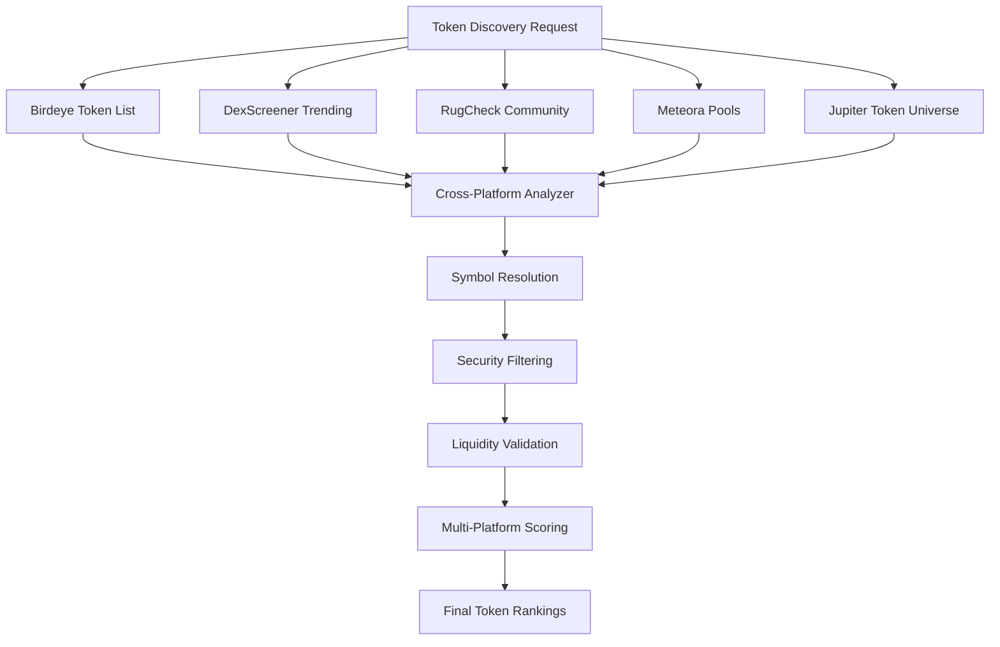

# Comprehensive Platforms and Endpoints Summary

## 🏗️ System Overview

The Virtuoso Gem Hunter uses a **multi-platform token discovery architecture** that integrates **5 major DeFi data providers** across **10+ distinct endpoints** to provide comprehensive cross-platform validation and enhanced token discovery capabilities.

---

## 📊 Platform Summary

| Platform | Base URL | Primary Purpose | Endpoints Used | Cost | Status |
|----------|----------|-----------------|----------------|------|--------|
| **Birdeye** | `https://public-api.birdeye.so` | Comprehensive token analysis & trending | 4 endpoints | Free (rate limited) | ✅ Active |
| **DexScreener** | `https://api.dexscreener.com` | Social validation & promotional tracking | 4 endpoints | Free | ✅ Active |
| **RugCheck** | `https://api.rugcheck.xyz` | Security analysis & community validation | 3 endpoints | Free | ✅ Active |
| **Jupiter** | `https://quote-api.jup.ag` + `https://token.jup.ag` | Liquidity analysis & token universe | 2 endpoints | Free | ✅ Active |
| **Meteora** | `https://universal-search-api.meteora.ag` | DEX pool volume analysis | 1 endpoint | Free | ✅ Active |

---

## 🐦 1. Birdeye Platform (4 Endpoints)

**Base URL**: `https://public-api.birdeye.so`  
**Purpose**: Primary token analysis and trending detection  
**Authentication**: API Key required (`X-API-KEY` header)  
**Rate Limits**: 100 requests/minute (free tier)

### 1.1 Token Discovery Endpoints

#### `/defi/v3/token/list`
- **Purpose**: Primary token discovery with advanced filtering
- **Method**: GET
- **Key Parameters**:
  - `chain=solana` (required)
  - `limit=100` (max tokens per request)
  - `sort_by=volume_1h_change_percent|last_trade_unix_time|fdv|liquidity`
  - `sort_type=desc`
- **Response Fields Used**:
  - `address`, `symbol`, `liquidity`, `market_cap`, `holder`
  - `volume_Xh_usd` (1h, 2h, 4h, 8h, 24h)
  - `price_change_Xh_percent`, `trade_Xh_count`
- **Usage**: Progressive 5-attempt discovery pipeline with filter relaxation

#### `/defi/token_trending`
- **Purpose**: Trending token discovery
- **Method**: GET
- **Key Parameters**:
  - `limit=50` (max trending tokens)
- **Response Fields**: Same as token list endpoint
- **Usage**: Fallback when v3 discovery yields insufficient results

### 1.2 Token Analysis Endpoints

#### `/defi/token_overview`
- **Purpose**: Comprehensive token metadata and metrics
- **Method**: GET
- **Key Parameters**:
  - `token_address` (required)
- **Response Fields Used**:
  - `name`, `symbol`, `decimals`, `price`, `fdv`, `marketCap`
  - `supply`, `volume`, `socials`, `createdAt`
- **Usage**: Batch processing (5 concurrent calls max)

#### `/defi/multi_price`
- **Purpose**: Bulk price data for multiple tokens
- **Method**: POST
- **Key Parameters**:
  - `list_address` (comma-separated addresses, max 50)
  - `include_liquidity=true`
- **Response Fields Used**:
  - `price`, `liquidity`, `priceChange`, `volume`, `volumeChange`
- **Usage**: Optimized batch price fetching

---

## 📱 2. DexScreener Platform (4 Endpoints)

**Base URL**: `https://api.dexscreener.com`  
**Purpose**: Social validation, promotional tracking, and narrative analysis  
**Authentication**: None required  
**Rate Limits**: Generous (no strict limits documented)

### 2.1 Discovery Endpoints

#### `/latest/dex/tokens/{chainId}`
- **Purpose**: Trending tokens with social metrics
- **Method**: GET
- **Key Parameters**:
  - `chainId=solana`
- **Response Fields Used**:
  - `baseToken.address`, `baseToken.symbol`, `baseToken.name`
  - `volume`, `priceChange`, `liquidity`
- **Usage**: Social sentiment analysis

#### `/latest/dex/search`
- **Purpose**: Narrative-based token discovery
- **Method**: GET
- **Key Parameters**:
  - `q={narrative}` (AI, agent, pump, meme, dog, cat, pepe, gaming, DeFi)
- **Response Fields Used**: Same as trending endpoint
- **Usage**: Captures tokens riding trending narratives

### 2.2 Social Analysis Endpoints

#### `/latest/dex/tokens/{address}/info`
- **Purpose**: Token profile and social data
- **Method**: GET
- **Response Fields Used**:
  - `description`, `website`, `twitter`, `telegram`
  - `social_score`, `narrative_strength`
- **Usage**: Social validation scoring

#### `/latest/dex/tokens/boosted`
- **Purpose**: Promoted/paid token listings
- **Method**: GET
- **Response Fields Used**: Standard token data + promotion metrics
- **Usage**: Identifies tokens with marketing investment

---

## 🛡️ 3. RugCheck Platform (3 Endpoints)

**Base URL**: `https://api.rugcheck.xyz`  
**Purpose**: Token security analysis and risk assessment  
**Authentication**: None required  
**Rate Limits**: 2 requests/second (conservative)

### 3.1 Security Analysis Endpoints

#### `/v1/tokens/{address}/report`
- **Purpose**: Comprehensive security report
- **Method**: GET
- **Response Fields Used**:
  - `is_scam`, `is_risky`, `security_score`
  - `holder_distribution`, `top_holders`
  - `mint_authority`, `freeze_authority`, `creator_address`
- **Usage**: Deep security analysis for high-value tokens

#### `/v1/tokens/{address}/summary`
- **Purpose**: Basic security summary
- **Method**: GET
- **Response Fields Used**:
  - `risk_level`, `safety_score`, `quick_flags`
- **Usage**: Fast security screening

### 3.2 Community Validation

#### `/v1/tokens/{chain}/trending`
- **Purpose**: Community-validated trending tokens
- **Method**: GET
- **Key Parameters**:
  - `chain=solana`
- **Response Fields Used**:
  - `address`, `symbol`, `vote_count`, `sentiment_score`
- **Usage**: Community sentiment analysis (exactly 10 tokens)

---

## 🪐 4. Jupiter Platform (2 Endpoints)

**Base URL**: Multiple domains  
**Purpose**: Liquidity analysis and comprehensive token universe  
**Authentication**: Optional API key for enhanced limits  
**Rate Limits**: 1 RPS / 60 RPM (free tier)

### 4.1 Token Universe

#### `https://token.jup.ag/all`
- **Purpose**: Complete token list with metadata
- **Method**: GET
- **Response Fields Used**:
  - `address`, `symbol`, `name`, `decimals`
  - `logoURI`, `tags`
- **Usage**: Symbol resolution (287,863+ tokens)

### 4.2 Liquidity Analysis

#### `https://quote-api.jup.ag/v6/quote`
- **Purpose**: Real-time liquidity and routing analysis
- **Method**: GET
- **Key Parameters**:
  - `inputMint` (input token address)
  - `outputMint` (output token address, typically SOL)
  - `amount` (swap amount for price impact calculation)
  - `slippageBps=1000` (10% slippage tolerance)
- **Response Fields Used**:
  - `inAmount`, `outAmount`, `priceImpactPct`
  - `routePlan` (swap routes), `swapMode`
- **Usage**: Liquidity validation and routing complexity analysis

---

## 🌊 5. Meteora Platform (1 Endpoint)

**Base URL**: `https://universal-search-api.meteora.ag`  
**Purpose**: DEX pool volume analysis and high-activity detection  
**Authentication**: None required  
**Rate Limits**: Generous (no strict limits)

### 5.1 Pool Analysis

#### `/pools/trending`
- **Purpose**: High-volume trading pools analysis
- **Method**: GET
- **Response Fields Used**:
  - `pool_id`, `pool_name`, `token_a`, `token_b`
  - `volume_24h`, `tvl`, `vlr` (Volume-to-Liquidity Ratio)
  - `fee_24h`, `trending_score`
- **Usage**: Volume-based token discovery (40 pools analyzed)

---

## 🔄 Cross-Platform Integration Architecture

### Discovery Pipeline Flow



### Platform Validation Matrix

| Token Source | Birdeye | DexScreener | RugCheck | Jupiter | Meteora | Confidence Level |
|--------------|---------|-------------|----------|---------|---------|------------------|
| Single Platform | ✅ | ❌ | ❌ | ❌ | ❌ | Low (20%) |
| Two Platforms | ✅ | ✅ | ❌ | ❌ | ❌ | Medium (60%) |
| Three+ Platforms | ✅ | ✅ | ✅ | ✅ | ✅ | High (90%) |

---

## 📈 API Performance Metrics

### Typical Performance (Recent Test Results)

| Platform | Avg Response Time | Success Rate | Calls per Test | Reliability |
|----------|------------------|--------------|----------------|-------------|
| **Jupiter** | 417ms | 100% | 15 | ✅ Excellent |
| **Meteora** | 604ms | 100% | 1 | ✅ Excellent |
| **DexScreener** | 528ms | 100% | 12 | ✅ Excellent |
| **RugCheck** | 653ms | 100% | 1 | ✅ Excellent |
| **Birdeye** | 725ms | Variable* | 3-33 | ⚠️ API Key Issues |

*Note: Birdeye success rate depends on API key configuration

### Rate Limiting Strategy

```python
# Conservative rate limiting for production
RATE_LIMITS = {
    'birdeye': {'rps': 0.8, 'rpm': 48},      # 80% of 1 RPS limit
    'jupiter': {'rps': 0.8, 'rpm': 48},      # 80% of 1 RPS limit  
    'dexscreener': {'rps': 2.0, 'rpm': 120}, # Conservative estimate
    'rugcheck': {'rps': 0.5, 'rpm': 30},     # 2s between requests
    'meteora': {'rps': 1.0, 'rpm': 60}       # Conservative estimate
}
```

---

## 🚀 Advanced Features

### 1. Batch Optimization
- **Multi-token requests**: Jupiter Quote API, Birdeye Multi-Price
- **Concurrent processing**: Semaphore-controlled parallel requests
- **Progressive filtering**: Eliminate low-quality tokens early

### 2. Symbol Resolution Pipeline
```python
# Symbol resolution priority order:
1. Jupiter Token List (287,863 tokens)
2. Birdeye Token Overview
3. DexScreener Token Info  
4. RugCheck Token Report
5. Platform-specific extraction
```

### 3. Cross-Platform Deduplication
- **Address-based matching**: Canonical token address comparison
- **Platform scoring**: Weight by source reliability
- **Aggregate metrics**: Combine scores from multiple sources

### 4. Intelligent Caching
- **TTL-based caching**: 5-minute cache for batch data
- **Recently analyzed tracking**: Avoid reprocessing for 2 hours
- **Platform-specific cache**: Separate cache keys per data source

---

## 💡 Usage Recommendations

### Production Deployment
1. **API Key Management**: Secure Birdeye API key required
2. **Rate Limiting**: Implement conservative limits with backoff
3. **Error Handling**: Graceful degradation when platforms unavailable
4. **Monitoring**: Track API success rates and response times
5. **Cost Optimization**: Batch requests and cache aggressively

### Discovery Strategy
1. **Multi-Platform Validation**: Require 2+ platform confirmation
2. **Security First**: Always apply RugCheck filtering
3. **Liquidity Validation**: Use Jupiter Quote API for final validation
4. **Volume Analysis**: Leverage Meteora for DEX activity insights
5. **Social Sentiment**: Include DexScreener for narrative tracking

---

## 📚 Additional Resources

- **Birdeye API Docs**: https://docs.birdeye.so/reference
- **DexScreener API**: https://docs.dexscreener.com/
- **RugCheck API**: https://api.rugcheck.xyz/swagger/
- **Jupiter API**: https://station.jup.ag/docs/apis
- **Meteora Docs**: https://docs.meteora.ag/

---

*Last Updated: December 23, 2024*  
*System Version: Enhanced Cross-Platform Integration v4.0* 