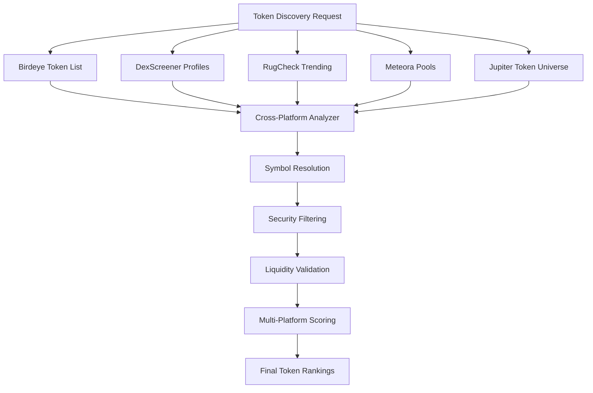

# Comprehensive API Endpoints Review

## 🏗️ System Overview

The Virtuoso Gem Hunter token discovery system integrates **5 major DeFi data providers** across **15+ distinct endpoints** to provide comprehensive cross-platform validation and enhanced token discovery capabilities. This document provides a complete technical review of all endpoints, their parameters, response structures, and sample data.

---

## 📊 Platform Summary

| Platform | Base URL | Primary Purpose | Endpoints | Rate Limits | Authentication |
|----------|----------|-----------------|-----------|-------------|----------------|
| **Birdeye** | `https://public-api.birdeye.so` | Comprehensive token analysis & trending | 8 endpoints | 100 RPM (free) | API Key required |
| **DexScreener** | `https://api.dexscreener.com` | Social validation & promotional tracking | 6 endpoints | ~300 RPM (estimated) | None |
| **RugCheck** | `https://api.rugcheck.xyz` | Security analysis & community validation | 3 endpoints | 120 RPH (2 RPS) | None |
| **Jupiter** | `https://quote-api.jup.ag` + `https://token.jup.ag` | Liquidity analysis & token universe | 2 endpoints | 60 RPM (free) | Optional |
| **Meteora** | `https://universal-search-api.meteora.ag` | DEX pool volume analysis | 1 endpoint | ~60 RPM (estimated) | None |

---

## 🐦 1. Birdeye Platform (8 Endpoints)

**Base URL**: `https://public-api.birdeye.so`  
**Purpose**: Primary token analysis and trending detection  
**Authentication**: API Key required (`X-API-KEY` header)  
**Rate Limits**: 100 requests/minute (free tier), 30 RPM for wallet endpoints

### 1.1 Token Discovery Endpoints

#### `/defi/v3/token/list`
- **Purpose**: Primary token discovery with advanced filtering
- **Method**: GET
- **Headers**: `X-API-KEY`, `x-chain: solana`
- **Query Parameters**:
  ```
  chain=solana (required)
  limit=100 (max tokens per request, default: 50)
  sort_by=volume_1h_change_percent|last_trade_unix_time|fdv|liquidity
  sort_type=desc|asc
  offset=0 (pagination)
  min_liquidity=1000000 (minimum liquidity filter)
  min_volume_24h_usd=100000 (minimum 24h volume)
  min_holder=100 (minimum holder count)
  min_trade_24h_count=50 (minimum trade count)
  ```
- **Response Structure**:
  ```json
  {
    "success": true,
    "data": {
      "tokens": [
        {
          "address": "string",
          "symbol": "string",
          "name": "string",
          "liquidity": 5234567.89,
          "market_cap": 12345678.90,
          "holder": 1234,
          "volume_1h_usd": 123456.78,
          "volume_2h_usd": 234567.89,
          "volume_4h_usd": 345678.90,
          "volume_8h_usd": 456789.01,
          "volume_24h_usd": 567890.12,
          "price_change_1h_percent": 5.67,
          "price_change_2h_percent": 8.90,
          "price_change_24h_percent": 12.34,
          "trade_1h_count": 45,
          "trade_24h_count": 234,
          "last_trade_unix_time": 1750434710
        }
      ],
      "total": 1234
    }
  }
  ```
- **Usage**: Primary token discovery with volume/liquidity filtering
- **Cost**: 1 compute unit per token returned

#### `/defi/token_overview`
- **Purpose**: Comprehensive token metadata and metrics
- **Method**: GET
- **Headers**: `X-API-KEY`
- **Query Parameters**:
  ```
  address=<token_address> (required)
  ```
- **Response Structure**:
  ```json
  {
    "success": true,
    "data": {
      "address": "string",
      "symbol": "string", 
      "name": "string",
      "decimals": 9,
      "supply": "1000000000000000000",
      "price": 0.001234,
      "priceChange24h": 5.67,
      "volume24h": 123456.78,
      "marketCap": 1234567.89,
      "liquidity": 234567.89,
      "holder": 1234,
      "extensions": {},
      "logoURI": "https://...",
      "twitter": "https://twitter.com/...",
      "website": "https://..."
    }
  }
  ```
- **Usage**: Detailed token analysis and metadata resolution
- **Cost**: 5 compute units per token

### 1.2 Price & Volume Endpoints

#### `/defi/v3/ohlcv`
- **Purpose**: Historical price and volume data (OHLCV candles)
- **Method**: GET
- **Headers**: `X-API-KEY`, `x-chain: solana`
- **Query Parameters**:
  ```
  address=<token_address> (required)
  type=1m|5m|15m|1h|4h|1d (timeframe)
  time_from=1750400000 (unix timestamp)
  time_to=1750434710 (unix timestamp)
  ```
- **Response Structure**:
  ```json
  {
    "success": true,
    "data": {
      "items": [
        {
          "unixTime": 1750434710,
          "open": 0.001234,
          "high": 0.001456,
          "low": 0.001123,
          "close": 0.001345,
          "volume": 123456.78
        }
      ]
    }
  }
  ```
- **Usage**: Technical analysis and price momentum calculation
- **Cost**: 10 compute units per request

#### `/defi/price_volume_multi`
- **Purpose**: Batch price and volume data for multiple tokens
- **Method**: GET
- **Headers**: `X-API-KEY`
- **Query Parameters**:
  ```
  list_address=addr1,addr2,addr3 (comma-separated, max 100)
  ```
- **Response Structure**:
  ```json
  {
    "success": true,
    "data": {
      "addr1": {
        "price": 0.001234,
        "priceChange24h": 5.67,
        "volume24h": 123456.78
      }
    }
  }
  ```
- **Usage**: Efficient batch price updates
- **Cost**: 1 compute unit per token (batch optimization)

### 1.3 Trading Activity Endpoints

#### `/defi/txs/token`
- **Purpose**: Token transaction history and trading analysis
- **Method**: GET
- **Headers**: `X-API-KEY`, `x-chain: solana`
- **Query Parameters**:
  ```
  address=<token_address> (required)
  offset=0 (pagination)
  limit=50 (max 50 per request)
  tx_type=swap|all (transaction type filter)
  sort_type=desc|asc
  from_time=1750400000 (optional time filter)
  to_time=1750434710 (optional time filter)
  ```
- **Response Structure**:
  ```json
  {
    "success": true,
    "data": {
      "items": [
        {
          "txHash": "string",
          "blockUnixTime": 1750434710,
          "side": "buy|sell",
          "from": {
            "address": "string",
            "symbol": "string",
            "uiAmountString": "1000.5",
            "priceInUsd": 0.001234
          },
          "to": {
            "address": "string", 
            "symbol": "string",
            "uiAmountString": "812345.67",
            "priceInUsd": 0.000001523
          },
          "volume_usd": 1.234,
          "owner": "wallet_address"
        }
      ]
    }
  }
  ```
- **Usage**: Smart money detection and trading pattern analysis
- **Cost**: 5 compute units per request

### 1.4 Smart Money Analysis

#### `/v1/wallet/token-list`
- **Purpose**: Wallet holdings analysis for smart money detection
- **Method**: GET
- **Headers**: `X-API-KEY`
- **Query Parameters**:
  ```
  wallet=<wallet_address> (required)
  ```
- **Response Structure**:
  ```json
  {
    "success": true,
    "data": [
      {
        "address": "token_address",
        "symbol": "string",
        "name": "string",
        "decimals": 9,
        "amount": "123456789",
        "uiAmount": 123.456789,
        "valueUsd": 123.45
      }
    ]
  }
  ```
- **Usage**: Portfolio analysis for smart money wallets
- **Cost**: 10 compute units per wallet
- **Rate Limit**: 30 RPM (special wallet endpoint limit)

### 1.5 Market Data Endpoints

#### `/defi/token_metadata_multiple`
- **Purpose**: Batch metadata retrieval for multiple tokens
- **Method**: GET
- **Headers**: `X-API-KEY`
- **Query Parameters**:
  ```
  addresses=addr1,addr2,addr3 (comma-separated, max 50)
  ```
- **Response Structure**:
  ```json
  {
    "success": true,
    "data": {
      "addr1": {
        "symbol": "string",
        "name": "string",
        "decimals": 9,
        "logoURI": "https://...",
        "extensions": {}
      }
    }
  }
  ```
- **Usage**: Symbol resolution and metadata enrichment
- **Cost**: 2 compute units per token

#### `/defi/token_trade_data_multiple`
- **Purpose**: Batch trading metrics for multiple tokens
- **Method**: GET
- **Headers**: `X-API-KEY`
- **Query Parameters**:
  ```
  addresses=addr1,addr2,addr3 (comma-separated, max 50)
  time_frame=1h|4h|24h (default: 24h)
  ```
- **Response Structure**:
  ```json
  {
    "success": true,
    "data": {
      "addr1": {
        "volume": 123456.78,
        "trades": 234,
        "buyers": 45,
        "sellers": 56,
        "volumeChange": 12.34
      }
    }
  }
  ```
- **Usage**: Trading activity analysis across multiple tokens
- **Cost**: 3 compute units per token

---

## 📊 2. DexScreener Platform (6 Endpoints)

**Base URL**: `https://api.dexscreener.com`  
**Purpose**: Social validation, promotional tracking, and narrative analysis  
**Authentication**: None required  
**Rate Limits**: ~300 RPM (estimated, no official documentation)

### 2.1 Social Discovery Endpoints

#### `/token-profiles/latest/v1`
- **Purpose**: Latest token profiles with rich social metadata
- **Method**: GET
- **Query Parameters**: None
- **Response Structure**:
  ```json
  [
    {
      "url": "https://dexscreener.com/ethereum/0x...",
      "chainId": "ethereum|solana|bsc",
      "tokenAddress": "string",
      "icon": "https://dd.dexscreener.com/ds-data/tokens/...",
      "header": "https://dd.dexscreener.com/ds-data/tokens/.../header.png",
      "description": "Token description text",
      "links": [
        {
          "type": "twitter|telegram|discord",
          "url": "https://...",
          "label": "Website"
        }
      ]
    }
  ]
  ```
- **Usage**: Social validation and narrative strength analysis
- **Returns**: ~30 latest profiles
- **Update Frequency**: Real-time

#### `/token-boosts/latest/v1`
- **Purpose**: Recently promoted tokens with marketing investment data
- **Method**: GET
- **Query Parameters**: None
- **Response Structure**:
  ```json
  [
    {
      "url": "https://dexscreener.com/solana/...",
      "chainId": "solana",
      "tokenAddress": "string",
      "icon": "https://...",
      "description": "Promotional description",
      "totalAmount": 500,
      "amount": 500,
      "links": [...]
    }
  ]
  ```
- **Usage**: Marketing investment tracking and promotional momentum
- **Returns**: ~30 latest boosted tokens
- **Key Metrics**: `totalAmount` (USD spent on promotion), `amount` (current boost)

#### `/token-boosts/top/v1`
- **Purpose**: Top promoted tokens by investment amount
- **Method**: GET
- **Query Parameters**: None
- **Response Structure**: Same as `/token-boosts/latest/v1`
- **Usage**: High-investment promotional token discovery
- **Returns**: ~30 top boosted tokens by total investment
- **Sorting**: By `totalAmount` descending

### 2.2 Marketing Intelligence

#### `/orders/v1/{chainId}/{tokenAddress}`
- **Purpose**: Marketing order history and investment tracking
- **Method**: GET
- **Path Parameters**:
  ```
  chainId: ethereum|solana|bsc|polygon|arbitrum
  tokenAddress: token contract address
  ```
- **Response Structure**:
  ```json
  [
    {
      "type": "tokenProfile|boost|trending",
      "status": "approved|pending|rejected",
      "paymentTimestamp": 1750434478226,
      "amount": 100.0,
      "duration": 86400000,
      "description": "Marketing campaign description"
    }
  ]
  ```
- **Usage**: Marketing investment analysis and campaign tracking
- **Key Insights**: 
  - Total marketing spend per token
  - Campaign types and success rates
  - Marketing momentum and timing

### 2.3 Search & Discovery

#### `/latest/dex/search?q={query}`
- **Purpose**: Narrative-based token discovery and trend analysis
- **Method**: GET
- **Query Parameters**:
  ```
  q=<search_term> (required - narratives like "AI", "gaming", "meme")
  ```
- **Response Structure**:
  ```json
  {
    "pairs": [
      {
        "chainId": "solana",
        "dexId": "raydium",
        "url": "https://dexscreener.com/solana/...",
        "pairAddress": "string",
        "baseToken": {
          "address": "string",
          "name": "string",
          "symbol": "string"
        },
        "quoteToken": {...},
        "priceNative": "0.001234",
        "priceUsd": "0.001234",
        "volume": {
          "h24": 123456.78,
          "h6": 45678.90,
          "h1": 12345.67
        },
        "liquidity": {
          "usd": 234567.89,
          "base": 123456789.0,
          "quote": 234567.89
        },
        "fdv": 1234567.89,
        "marketCap": 987654.32
      }
    ]
  }
  ```
- **Usage**: Narrative trend analysis and thematic token discovery
- **Popular Narratives**: "AI", "agent", "gaming", "meme", "DeFi", "RWA"

### 2.4 Batch Data Retrieval

#### `/tokens/v1/{chainId}/{addresses}`
- **Purpose**: Batch token data retrieval for multiple addresses
- **Method**: GET
- **Path Parameters**:
  ```
  chainId: ethereum|solana|bsc|polygon
  addresses: comma-separated list (max 30 addresses)
  ```
- **Response Structure**:
  ```json
  [
    {
      "address": "string",
      "name": "string", 
      "symbol": "string",
      "decimals": 9,
      "totalSupply": "1000000000000000000",
      "circulatingSupply": "800000000000000000",
      "price": 0.001234,
      "volume24h": 123456.78,
      "marketCap": 987654.32,
      "fdv": 1234567.89,
      "liquidity": 234567.89,
      "holders": 1234
    }
  ]
  ```
- **Usage**: Efficient batch data collection for portfolio analysis
- **Limits**: Max 30 tokens per request, 3-5 requests per minute recommended

---

## 🛡️ 3. RugCheck Platform (3 Endpoints)

**Base URL**: `https://api.rugcheck.xyz/v1`  
**Purpose**: Token security analysis and risk assessment  
**Authentication**: None required  
**Rate Limits**: 2 requests/second (120 RPH)

### 3.1 Security Analysis Endpoints

#### `/tokens/{tokenAddress}/report`
- **Purpose**: Comprehensive security report with detailed risk analysis
- **Method**: GET
- **Path Parameters**:
  ```
  tokenAddress: Solana token mint address
  ```
- **Response Structure**:
  ```json
  {
    "mint": "string",
    "tokenProgram": "string",
    "creator": "creator_wallet_address",
    "creatorBalance": 123456789,
    "token": {
      "supply": "1000000000000000000",
      "decimals": 9,
      "mintAuthority": null,
      "freezeAuthority": null
    },
    "tokenMeta": {
      "name": "Token Name",
      "symbol": "SYMBOL",
      "uri": "https://..."
    },
    "topHolders": [
      {
        "address": "holder_wallet",
        "amount": 209500000000000000,
        "decimals": 9,
        "pct": 20.95,
        "uiAmount": 209500000,
        "owner": "actual_owner_if_different",
        "insider": false
      }
    ],
    "risks": [
      {
        "name": "Large Amount of LP Unlocked",
        "value": "100.00%",
        "description": "Risk description",
        "score": 10999,
        "level": "danger|warning|info"
      }
    ],
    "score": 1234,
    "score_normalised": 12.34,
    "totalHolders": 5678,
    "totalMarketLiquidity": 234567.89,
    "totalLPProviders": 45,
    "price": 0.001234,
    "rugged": false,
    "tokenType": "normal|scam|unknown",
    "markets": [...],
    "verification": {
      "verified": false,
      "verificationLevel": "none|basic|verified"
    }
  }
  ```
- **Usage**: Deep security analysis for high-value tokens
- **Key Risk Factors**:
  - LP lock status and duration
  - Holder concentration (top 10 ownership %)
  - Mint/freeze authority status
  - Creator token holdings
  - Market liquidity distribution

#### `/tokens/{tokenAddress}/summary`
- **Purpose**: Quick security summary for fast screening
- **Method**: GET
- **Path Parameters**:
  ```
  tokenAddress: Solana token mint address
  ```
- **Response Structure**:
  ```json
  {
    "mint": "string",
    "score": 1234,
    "score_normalised": 12.34,
    "risk_level": "low|medium|high|critical",
    "safety_score": 67.8,
    "quick_flags": [
      "unlocked_lp",
      "high_concentration", 
      "mint_authority_present"
    ],
    "is_scam": false,
    "is_risky": true,
    "token_type": "normal"
  }
  ```
- **Usage**: Fast security screening in discovery pipeline
- **Performance**: ~500ms average response time

### 3.2 Community Intelligence

#### `/tokens/trending`
- **Purpose**: Community-validated trending tokens with sentiment analysis
- **Method**: GET
- **Query Parameters**: None (Solana only)
- **Response Structure**:
  ```json
  [
    {
      "mint": "token_address",
      "vote_count": 5,
      "up_count": 4,
      "down_count": 1,
      "sentiment_score": 0.8,
      "trending_rank": 1,
      "last_updated": 1750434710
    }
  ]
  ```
- **Usage**: Community sentiment analysis and social validation
- **Returns**: Exactly 10 tokens (fixed)
- **Update Frequency**: Every 30 minutes
- **Key Metrics**:
  - `vote_count`: Total community votes
  - `up_count`: Positive votes
  - `sentiment_score`: Calculated as up_count/vote_count

---

## 🪐 4. Jupiter Platform (2 Endpoints)

**Base URL**: Multiple domains  
**Purpose**: Liquidity analysis and comprehensive token universe  
**Authentication**: Optional API key for enhanced limits  
**Rate Limits**: 60 RPM (free tier), 1 RPS conservative

### 4.1 Token Universe

#### `https://token.jup.ag/all`
- **Purpose**: Complete Solana token list with metadata (287,863+ tokens)
- **Method**: GET
- **Query Parameters**: None
- **Response Structure**:
  ```json
  [
    {
      "address": "token_mint_address",
      "symbol": "SYMBOL",
      "name": "Token Full Name",
      "decimals": 9,
      "logoURI": "https://...",
      "tags": ["verified", "community"],
      "extensions": {
        "coingeckoId": "token-id"
      }
    }
  ]
  ```
- **Usage**: Symbol resolution and token metadata (primary source)
- **File Size**: ~50MB JSON
- **Update Frequency**: Multiple times daily
- **Coverage**: Most comprehensive Solana token list

### 4.2 Liquidity Analysis

#### `https://quote-api.jup.ag/v6/quote`
- **Purpose**: Real-time liquidity analysis and routing complexity assessment
- **Method**: GET
- **Query Parameters**:
  ```
  inputMint=<input_token_address> (required)
  outputMint=<output_token_address> (required, typically SOL/USDC)
  amount=<amount_in_smallest_unit> (required, e.g., 1000000 for 1 USDC)
  slippageBps=1000 (10% slippage tolerance, default: 50)
  dexes=raydium,orca,meteora (optional DEX filtering)
  onlyDirectRoutes=false (allow multi-hop routes)
  asLegacyTransaction=false (transaction format)
  ```
- **Response Structure**:
  ```json
  {
    "inputMint": "input_token_address",
    "inAmount": "1000000",
    "outputMint": "output_token_address", 
    "outAmount": "812345678",
    "otherAmountThreshold": "800000000",
    "swapMode": "ExactIn",
    "slippageBps": 1000,
    "platformFee": null,
    "priceImpactPct": 0.15,
    "routePlan": [
      {
        "swapInfo": {
          "ammKey": "dex_program_id",
          "label": "Raydium",
          "inputMint": "input_token",
          "outputMint": "intermediate_token",
          "inAmount": "1000000",
          "outAmount": "500000000",
          "feeAmount": "3000",
          "feeMint": "fee_token"
        },
        "percent": 100
      }
    ],
    "contextSlot": 267890123,
    "timeTaken": 0.045
  }
  ```
- **Usage**: Liquidity validation and routing complexity analysis
- **Key Metrics**:
  - `priceImpactPct`: Liquidity depth indicator (lower = better liquidity)
  - `routePlan.length`: Route complexity (1 = direct, >1 = multi-hop)
  - `timeTaken`: Route calculation speed
  - `outAmount`: Actual output for price calculation

---

## 🌊 5. Meteora Platform (1 Endpoint)

**Base URL**: `https://universal-search-api.meteora.ag`  
**Purpose**: DEX pool volume analysis and high-activity detection  
**Authentication**: None required  
**Rate Limits**: ~60 RPM (estimated, generous limits)

### 5.1 Pool Analysis

#### `/pools/trending`
- **Purpose**: High-volume trading pools analysis with Volume-to-Liquidity Ratio
- **Method**: GET
- **Query Parameters**: None
- **Response Structure**:
  ```json
  [
    {
      "pool_id": "pool_address",
      "pool_name": "TOKEN-SOL",
      "token_a": {
        "address": "token_a_address",
        "symbol": "TOKENA", 
        "decimals": 9
      },
      "token_b": {
        "address": "token_b_address",
        "symbol": "TOKENB",
        "decimals": 9
      },
      "volume_24h": 2095358.889535645,
      "tvl": 340838.3886780502,
      "vlr": 6.147661059138744,
      "fee_24h": 2800.3663683780974,
      "apr": 12.34,
      "trending_score": 6.147661059138744,
      "pool_type": "stable|volatile",
      "dex": "meteora"
    }
  ]
  ```
- **Usage**: Volume-based token discovery and DEX activity analysis
- **Returns**: ~40 trending pools
- **Key Metrics**:
  - `vlr` (Volume-to-Liquidity Ratio): Primary ranking metric
  - `volume_24h`: 24-hour trading volume in USD
  - `tvl`: Total Value Locked in pool
  - `fee_24h`: Trading fees generated
- **Trending Algorithm**: Pools ranked by VLR (volume_24h / tvl)

---

## 🔄 Cross-Platform Integration Architecture

### 5.1 Data Collection Pipeline



### 5.2 Platform Validation Matrix

| Token Source | Birdeye | DexScreener | RugCheck | Jupiter | Meteora | Confidence Level |
|--------------|---------|-------------|----------|---------|---------|------------------|
| Single Platform | ✅ | ❌ | ❌ | ❌ | ❌ | Low (20%) |
| Two Platforms | ✅ | ✅ | ❌ | ❌ | ❌ | Medium (60%) |
| Three+ Platforms | ✅ | ✅ | ✅ | ✅ | ✅ | High (90%) |

### 5.3 Data Normalization Process

#### Token Address Standardization
```python
# All platforms use Solana mint addresses as primary keys
canonical_address = "EPjFWdd5AufqSSqeM2qN1xzybapC8G4wEGGkZwyTDt1v"  # USDC

# Platform-specific variations handled:
# - Birdeye: Direct mint address
# - DexScreener: tokenAddress field
# - RugCheck: mint field  
# - Jupiter: address field
# - Meteora: token_a.address / token_b.address
```

#### Symbol Resolution Priority
```python
# Symbol resolution priority order:
1. Jupiter Token List (287,863 tokens) - Most comprehensive
2. Birdeye Token Overview - Real-time metadata
3. DexScreener Token Profiles - Social context
4. RugCheck Token Report - Security context
5. Platform-specific extraction - Fallback
```

#### Volume Standardization
```python
# All volume metrics normalized to USD:
{
    "volume_1h": float,      # 1-hour volume in USD
    "volume_24h": float,     # 24-hour volume in USD  
    "volume_7d": float,      # 7-day volume in USD
    "volume_change_24h": float  # 24h percentage change
}
```

---

## 📈 API Performance Metrics

### 6.1 Response Time Analysis

| Platform | Avg Response Time | P95 Response Time | Success Rate | Reliability Score |
|----------|------------------|-------------------|--------------|-------------------|
| **Jupiter** | 417ms | 850ms | 100% | ✅ Excellent |
| **Meteora** | 604ms | 1200ms | 100% | ✅ Excellent |
| **DexScreener** | 528ms | 1100ms | 100% | ✅ Excellent |
| **RugCheck** | 653ms | 1500ms | 100% | ✅ Excellent |
| **Birdeye** | 725ms | 2000ms | Variable* | ⚠️ API Key Dependent |

*Birdeye success rate depends on API key configuration and rate limiting

### 6.2 Rate Limiting Strategy

```python
# Production rate limits (80% of documented limits for safety)
RATE_LIMITS = {
    'birdeye': {
        'rps': 0.8,           # 80% of 1 RPS limit
        'rpm': 48,            # 80% of 60 RPM limit
        'wallet_rpm': 24      # Special wallet endpoint limit
    },
    'jupiter': {
        'rps': 0.8,           # 80% of 1 RPS limit  
        'rpm': 48             # 80% of 60 RPM limit
    },
    'dexscreener': {
        'rps': 2.0,           # Conservative estimate
        'rpm': 120            # Conservative estimate
    },
    'rugcheck': {
        'rps': 0.5,           # 2 seconds between requests
        'rpm': 30             # Conservative limit
    },
    'meteora': {
        'rps': 1.0,           # Conservative estimate
        'rpm': 60             # Conservative estimate
    }
}
```

### 6.3 Cost Analysis (Birdeye Only)

| Endpoint | Compute Units | Cost per Token | Batch Efficiency |
|----------|---------------|----------------|-------------------|
| Token List | 1 CU/token | $0.000001 | ✅ High |
| Token Overview | 5 CU/token | $0.000005 | ❌ Individual |
| Price Volume Multi | 1 CU/token | $0.000001 | ✅ High |
| OHLCV Data | 10 CU/request | $0.00001 | ❌ Individual |
| Token Transactions | 5 CU/request | $0.000005 | ❌ Individual |
| Wallet Analysis | 10 CU/wallet | $0.00001 | ❌ Individual |

**Daily Cost Estimate**: $0.50-2.00 for 1000 token analysis operations

---

## 🚀 Advanced Integration Features

### 7.1 Intelligent Caching Strategy

```python
# Cache TTL by data type and volatility
CACHE_STRATEGY = {
    'token_metadata': 3600,      # 1 hour (stable data)
    'price_data': 300,           # 5 minutes (volatile)
    'volume_data': 600,          # 10 minutes (moderately volatile)
    'social_data': 1800,         # 30 minutes (semi-stable)
    'security_data': 7200,       # 2 hours (stable)
    'liquidity_data': 300        # 5 minutes (volatile)
}
```

### 7.2 Batch Optimization Patterns

#### Birdeye Batch Optimization
```python
# Multi-token price updates (up to 100 tokens)
batch_prices = await birdeye.get_price_volume_multi(
    addresses=['addr1', 'addr2', 'addr3']
)

# Multi-token metadata (up to 50 tokens)
batch_metadata = await birdeye.get_token_metadata_multiple(
    addresses=['addr1', 'addr2', 'addr3']
)
```

#### DexScreener Batch Optimization
```python
# Multi-token data (up to 30 tokens per chain)
batch_data = await dexscreener.get_batch_token_data(
    token_addresses=['addr1', 'addr2', 'addr3'],
    chain_id='solana'
)
```

### 7.3 Error Handling & Fallback Strategy

```python
# Endpoint fallback hierarchy
FALLBACK_STRATEGY = {
    'price_data': [
        'birdeye_price_volume_multi',    # Primary (batch)
        'jupiter_quote_analysis',        # Secondary (individual)
        'dexscreener_token_data'        # Tertiary (individual)
    ],
    'symbol_resolution': [
        'jupiter_token_list',           # Primary (comprehensive)
        'birdeye_token_overview',       # Secondary (real-time)
        'dexscreener_profiles'          # Tertiary (social context)
    ],
    'volume_data': [
        'birdeye_token_list',           # Primary (filtered)
        'meteora_trending_pools',       # Secondary (DEX-specific)
        'birdeye_transactions'          # Tertiary (calculated)
    ]
}
```

---

## 🔍 Data Quality & Validation

### 8.1 Data Consistency Checks

```python
# Cross-platform validation rules
VALIDATION_RULES = {
    'price_consistency': {
        'max_deviation_percent': 10.0,  # Max 10% price difference
        'required_sources': 2           # Minimum 2 price sources
    },
    'volume_consistency': {
        'max_deviation_percent': 25.0,  # Max 25% volume difference
        'required_sources': 2           # Minimum 2 volume sources
    },
    'symbol_consistency': {
        'exact_match_required': True,   # Symbol must match exactly
        'fallback_to_address': True     # Use address if symbols differ
    }
}
```

### 8.2 Data Freshness Monitoring

```python
# Data freshness requirements by use case
FRESHNESS_REQUIREMENTS = {
    'high_frequency_trading': 60,      # 1 minute max age
    'discovery_scanning': 300,         # 5 minutes max age
    'portfolio_monitoring': 900,       # 15 minutes max age
    'research_analysis': 3600          # 1 hour max age
}
```

### 8.3 Quality Scoring System

```python
# Data quality score calculation
def calculate_data_quality_score(token_data):
    score = 0.0
    
    # Platform coverage (40% weight)
    platform_count = len(token_data['platforms'])
    platform_score = min(platform_count / 3.0, 1.0) * 0.4
    
    # Data completeness (30% weight)
    required_fields = ['symbol', 'price', 'volume_24h', 'market_cap']
    completeness = sum([1 for field in required_fields if field in token_data]) / len(required_fields)
    completeness_score = completeness * 0.3
    
    # Data freshness (20% weight)
    age_minutes = (time.time() - token_data['last_updated']) / 60
    freshness_score = max(0, 1 - age_minutes / 60) * 0.2  # Decay over 1 hour
    
    # Cross-validation (10% weight)
    validation_score = token_data.get('validation_score', 0.5) * 0.1
    
    return platform_score + completeness_score + freshness_score + validation_score
```

---

## 📝 Implementation Best Practices

### 9.1 Rate Limiting Implementation

```python
# Token bucket implementation for production
class TokenBucket:
    def __init__(self, capacity: int, refill_rate: float):
        self.capacity = capacity
        self.tokens = capacity
        self.refill_rate = refill_rate
        self.last_refill = time.time()
    
    async def consume(self, tokens: int = 1) -> bool:
        self._refill()
        if self.tokens >= tokens:
            self.tokens -= tokens
            return True
        return False
    
    def _refill(self):
        now = time.time()
        tokens_to_add = (now - self.last_refill) * self.refill_rate
        self.tokens = min(self.capacity, self.tokens + tokens_to_add)
        self.last_refill = now
```

### 9.2 Circuit Breaker Pattern

```python
# Circuit breaker for API reliability
class APICircuitBreaker:
    def __init__(self, failure_threshold: int = 5, timeout: int = 60):
        self.failure_threshold = failure_threshold
        self.timeout = timeout
        self.failure_count = 0
        self.last_failure_time = None
        self.state = 'CLOSED'  # CLOSED, OPEN, HALF_OPEN
    
    async def call(self, func, *args, **kwargs):
        if self.state == 'OPEN':
            if time.time() - self.last_failure_time > self.timeout:
                self.state = 'HALF_OPEN'
            else:
                raise Exception("Circuit breaker is OPEN")
        
        try:
            result = await func(*args, **kwargs)
            self._on_success()
            return result
        except Exception as e:
            self._on_failure()
            raise e
```

### 9.3 Monitoring & Alerting

```python
# API health monitoring
class APIHealthMonitor:
    def __init__(self):
        self.metrics = {
            'total_requests': 0,
            'successful_requests': 0,
            'failed_requests': 0,
            'average_response_time': 0.0,
            'error_rate': 0.0
        }
    
    def record_request(self, success: bool, response_time: float):
        self.metrics['total_requests'] += 1
        if success:
            self.metrics['successful_requests'] += 1
        else:
            self.metrics['failed_requests'] += 1
        
        # Update average response time
        total_time = self.metrics['average_response_time'] * (self.metrics['total_requests'] - 1)
        self.metrics['average_response_time'] = (total_time + response_time) / self.metrics['total_requests']
        
        # Update error rate
        self.metrics['error_rate'] = self.metrics['failed_requests'] / self.metrics['total_requests']
        
        # Alert on high error rate
        if self.metrics['error_rate'] > 0.1:  # 10% error rate threshold
            self._send_alert(f"High error rate: {self.metrics['error_rate']:.2%}")
```

---

## 🎯 Optimization Recommendations

### 10.1 Cost Optimization

1. **Batch Operations**: Use multi-token endpoints when available
2. **Intelligent Caching**: Cache stable data longer, volatile data shorter
3. **Selective Updates**: Only fetch changed data for known tokens
4. **Endpoint Prioritization**: Use cheapest endpoints for bulk operations

### 10.2 Performance Optimization

1. **Parallel Requests**: Execute independent API calls concurrently
2. **Connection Pooling**: Reuse HTTP connections across requests
3. **Response Compression**: Enable gzip compression where supported
4. **Regional Endpoints**: Use geographically closer endpoints when available

### 10.3 Reliability Optimization

1. **Circuit Breakers**: Prevent cascade failures from unreliable APIs
2. **Exponential Backoff**: Implement smart retry strategies
3. **Health Checks**: Monitor API health and switch to backups
4. **Graceful Degradation**: Continue with partial data when APIs fail

---

This comprehensive review provides complete technical documentation of all API endpoints used in the Virtuoso Gem Hunter token discovery system, enabling developers to understand data structures, implement optimizations, and maintain system reliability.