# Phase 3 Deep Token Analysis - Comprehensive Summary

## Executive Summary

The Phase 3 Deep Token Analysis represents an advanced, multi-dimensional approach to token evaluation that goes beyond basic price and volume metrics. This analysis incorporates sophisticated methodologies including holder concentration analysis, price volatility assessment, market context evaluation, and comprehensive risk scoring to provide actionable trading insights.

### Key Performance Metrics
- **Analysis Scope**: 6 tokens analyzed in latest session (June 17, 2025)
- **Analysis Depth**: 37,649 lines of detailed data per session
- **Score Range**: 50.0 - 63.75 (C to B- grades)
- **Best Performer**: Xavier: Renegade Angel (63.75, B-)
- **Market Cap Range**: $289k - $2.3T (wide spectrum coverage)

---

## Analysis Framework Architecture

### 1. **Multi-Layer Data Acquisition**
```
Basic Data Layer → Holder Analysis → Volatility Analysis → Market Context → Scoring
```

#### Core Data Components:
- **Token Overview**: Price, market cap, liquidity, volume metrics
- **Token Age**: Creation date and maturity assessment
- **Security Analysis**: Smart contract security evaluation
- **Transaction History**: Recent trading activity patterns
- **Data Quality Assessment**: Completeness and reliability scoring

### 2. **Advanced Analytical Modules**

#### **Holder Concentration Analysis**
- **Purpose**: Identify whale dominance and distribution risks
- **Methodology**: Analyzes top holder percentages and concentration ratios
- **Risk Indicators**: High concentration = manipulation risk
- **Current Status**: Limited by API data availability

#### **Price Volatility Analysis**
- **Metrics**: Standard deviation, price swings, volatility patterns
- **Timeframes**: Multiple periods (1m, 5m, 30m, 1h, 2h, 4h, 8h, 24h)
- **Risk Assessment**: High volatility = higher risk/reward potential
- **Current Challenge**: Requires sufficient historical price data

#### **Market Context Analysis**
- **Market Cap Categorization**:
  - Nano Cap: < $1M
  - Micro Cap: $1M - $10M
  - Small Cap: $10M - $100M
  - Mid Cap: $100M - $1B
  - Large Cap: > $1B
- **Liquidity Assessment**: 
  - Insufficient: < $10k
  - Low: $10k - $100k
  - Moderate: $100k - $1M
  - High: > $1M
- **Market Maturity**: Early Stage vs Established

---

## Visual Pipeline & Process Diagrams

### **1. Overall Analysis Pipeline**


### **2. Detailed Scoring System Architecture**


### **3. Risk Assessment Matrix**


### **4. Detailed Process Flow with Error Handling**


### **5. Performance Correlation Analysis**

```mermaid
graph LR
    subgraph "Token Performance Correlation Analysis"
        A["Token Age (Days)"] --> B["Performance Score"]
        C["Holder Count"] --> B
        D["Liquidity Level"] --> B
        E["Market Cap"] --> B
        
        B --> F["Grade Classification"]
        
        subgraph "Age-Performance Pattern"
            G["Xavier: 233 days → 63.75 (B-)"]
            H["USDP: 2.3 days → 58.75 (C+)"]
            I["Palantir: 0.9 days → 53.75 (C)"]
            J["Others: <1 day → 50-55 (C)"]
        end
        
        subgraph "Risk-Age Correlation"
            K["233 days → Very Low Risk (10)"]
            L["1-3 days → Low Risk (25)"]
            M["<1 day → Medium Risk (35-40)"]
        end
        
        subgraph "Liquidity Crisis Distribution"
            N["0% Moderate/High Liquidity"]
            O["50% Low Liquidity"]
            P["17% Critical Liquidity"]
            Q["33% Insufficient Liquidity"]
        end
    end
    
    style A fill:#e1f5fe
    style B fill:#fff3e0
    style F fill:#c8e6c9
    style G fill:#dcedc8
    style H fill:#fff9c4
    style I fill:#ffccbc
    style J fill:#ffcdd2
    style N fill:#ffebee
    style O fill:#fff3e0
    style P fill:#ffccbc
    style Q fill:#ffcdd2
```



---

## Comprehensive Scoring System

### **Weighted Scoring Model**
```
Overall Score = (Data Quality × 0.2) + (Concentration × 0.3) + (Volatility × 0.25) + (Market Quality × 0.25)
```

#### **Individual Score Components**:
1. **Data Quality Score** (Weight: 20%)
   - Measures completeness and reliability of available data
   - Range: 0-100 points
   - Current Performance: 100% (excellent data availability)

2. **Concentration Score** (Weight: 30%)
   - Evaluates holder distribution and whale risk
   - Default: 50 points (when data unavailable)
   - Critical for manipulation risk assessment

3. **Volatility Score** (Weight: 25%)
   - Assesses price stability and trading risk
   - Default: 50 points (when insufficient data)
   - Higher volatility = higher risk/reward

4. **Market Quality Score** (Weight: 25%)
   - Combines liquidity, market cap, and maturity factors
   - Range: 25-30 points observed
   - Key differentiator between tokens

### **Grading Scale**
- **A (90-100)**: Exceptional quality, low risk
- **B+ (80-89)**: High quality, moderate risk
- **B (70-79)**: Good quality, acceptable risk
- **B- (60-69)**: Above average, some concerns
- **C+ (55-59)**: Below average, notable concerns
- **C (50-54)**: Poor quality, high risk
- **D (40-49)**: Very poor, extreme risk
- **F (<40)**: Avoid completely

---

## Token Analysis Results

### **Performance Distribution**
| Grade | Count | Percentage | Score Range |
|-------|-------|------------|-------------|
| B-    | 1     | 16.7%      | 63.75       |
| C+    | 3     | 50.0%      | 55.0-58.75  |
| C     | 2     | 33.3%      | 50.0-53.75  |

### **Individual Token Profiles**

#### **🏆 Top Performer: Xavier: Renegade Angel (XAVIER)**
- **Score**: 63.75 (B-)
- **Market Cap**: $14.7M (Small Cap)
- **Strengths**: Balanced metrics across all categories
- **Risk Level**: Medium
- **Recommendation**: HOLD/NEUTRAL with moderate position sizing

#### **🔍 Notable Observations**:

**Palantir Inu (PI)** - Score: 53.75 (C)
- Market Cap: $977k (Nano Cap)
- Age: 0.93 days (Very new)
- Risk Factors: Low liquidity, extreme newness

**United States Dominant Peg (USDP)** - Score: 58.75 (C+)
- Market Cap: $36.5M (Small Cap)
- Highest C+ grade achiever
- Better liquidity profile than smaller tokens

**Extreme Cases**:
- **DATBOI**: $5.1T market cap (data anomaly likely)
- **SHARKCAT**: $2.3T market cap (data anomaly likely)

---

## Detailed Token Statistics & Analysis

### 🏆 **1. Xavier: Renegade Angel (XAVIER)** - **TOP PERFORMER**
- **Address**: `69G8CpUVZAxbPMiEBrfCCCH445NwFxH6PzVL693Xpump`
- **Overall Score**: **63.75 (B-)** ⭐ *Highest Score*
- **Age**: 233.31 days ⭐ *Most Mature*
- **Market Cap**: $14.7M (Small Cap)
- **Holders**: 3,052
- **Liquidity**: $922,480
- **Price**: $0.0147
- **24h Change**: +20.33% (Healthy growth)
- **24h Volume**: $5,174,687
- **24h Trades**: 34,271
- **Buy/Sell Ratio (1h)**: 683/688 (49% buy pressure - Balanced)
- **Unique Wallets (1h)**: 364
- **Volume (1h)**: $210,153
- **Risk Level**: **Very Low (Score: 10)** ⭐ *Lowest Risk*
- **Market Category**: Small Cap
- **Liquidity Category**: Low Liquidity
- **Market Maturity**: **Developing Market** ⭐ *Only one to achieve this*
- **Risk Factors**: Low liquidity only
- **Alerts**: None ✅

---

### 📊 **2. United States Dominant Peg (USDP)**
- **Address**: `rCDpCrYepyYffZz7AQhBV1LMJvWo7mps8fWr4Bvpump`
- **Overall Score**: **58.75 (C+)**
- **Age**: 2.26 days
- **Market Cap**: $36.5M (Small Cap)
- **Holders**: 42,968 ⭐ *Most Distributed*
- **Liquidity**: $955,725 ⭐ *Highest Liquidity*
- **Price**: $0.0365
- **24h Change**: +71.93% (Strong growth)
- **24h Volume**: $13,211,823 ⭐ *Highest Volume*
- **24h Trades**: 102,091 ⭐ *Most Active Trading*
- **Buy/Sell Ratio (1h)**: 5,248/5,017 (51% buy pressure - Slightly bullish)
- **Unique Wallets (1h)**: 1,239 ⭐ *Most Active Wallets*
- **Volume (1h)**: $1,241,501 ⭐ *Highest 1h Volume*
- **Risk Level**: Low (Score: 25)
- **Market Category**: Small Cap
- **Liquidity Category**: Low Liquidity
- **Market Maturity**: Early Stage Market
- **Risk Factors**: Low liquidity, Very new token
- **Alerts**: None ✅

---

### 🔥 **3. Palantir Inu (PI)** - **EXTREME VOLATILITY**
- **Address**: `9b1BzC1af9gQBtegh5WcuFB6ARBYQk7PgURW1aogpump`
- **Overall Score**: **53.75 (C)**
- **Age**: 0.93 days (Very new)
- **Market Cap**: $977K (Nano Cap)
- **Holders**: 4,183
- **Liquidity**: $201,323
- **Price**: $0.000978
- **24h Change**: **+7,975%** 🚨 *Extreme Pump Event*
- **24h Volume**: $9,916,114
- **24h Trades**: 99,800
- **Buy/Sell Ratio (1h)**: 1,408/1,304 (52% buy pressure - Bullish)
- **Unique Wallets (1h)**: 951
- **Volume (1h)**: $274,290
- **Risk Level**: Low (Score: 25)
- **Market Category**: Nano Cap
- **Liquidity Category**: Low Liquidity
- **Market Maturity**: Early Stage Market
- **Risk Factors**: Low liquidity, Very new token
- **Alerts**: None (but extreme volatility warrants caution)

---

### ⚠️ **4. could (could)** - **LIQUIDITY CRISIS**
- **Address**: `9civd7ktdbBtSUgkyduxQoHhBLtThf9xr1Kvj5dcpump`
- **Overall Score**: **50.0 (C)** ⚠️ *Lowest Score*
- **Age**: 1.38 days
- **Market Cap**: $289K (Nano Cap)
- **Holders**: 2,122
- **Liquidity**: $62,055 ⚠️ *Critical Liquidity*
- **Price**: $0.000291
- **24h Change**: +9.28% (Stable)
- **24h Volume**: $2,658,051
- **24h Trades**: 29,745
- **Buy/Sell Ratio (1h)**: 239/280 (46% buy pressure - Bearish)
- **Unique Wallets (1h)**: 250
- **Volume (1h)**: $46,869
- **Risk Level**: Medium (Score: 35)
- **Market Category**: Nano Cap
- **Liquidity Category**: Critical Liquidity
- **Market Maturity**: Early Stage Market
- **Risk Factors**: Critical liquidity levels, Very new token
- **Alerts**: ⚠️ LIQUIDITY RISK: Critical liquidity levels

---

### 🚨 **5. Dat Boi (DATBOI)** - **DATA ANOMALY**
- **Address**: `4jXJcKQoojvFuA7MSzJLpgDvXyiACqLnMyh6ULEEnVhg`
- **Overall Score**: **55.0 (C+)**
- **Age**: 0.54 days (Very new)
- **Market Cap**: $5.17 **TRILLION** 🚨 *Likely Data Anomaly*
- **Holders**: 225 ⚠️ *Low Distribution*
- **Liquidity**: $0 🚨 *No Liquidity*
- **Price**: $5,167.04
- **24h Change**: **+3.4 BILLION %** 🚨 *Extreme Anomaly*
- **24h Volume**: $353,657
- **24h Trades**: 4,432
- **Buy/Sell Ratio (1h)**: 0/1 (0% buy pressure - No activity)
- **Unique Wallets (1h)**: 1
- **Volume (1h)**: $0
- **Risk Level**: Medium (Score: 40)
- **Market Category**: Large Cap
- **Liquidity Category**: Insufficient Liquidity
- **Market Maturity**: Early Stage Market
- **Risk Factors**: Insufficient liquidity, Very new token
- **Alerts**: 🚨 CRITICAL: Insufficient liquidity for safe trading

---

### 🚨 **6. SharkCat (SHARKCAT)** - **DATA ANOMALY**
- **Address**: `8jFpBJoJwHkYLgNgequJJu6CMt3LkY3P6QndUupLpump`
- **Overall Score**: **55.0 (C+)**
- **Age**: 0.47 days (Very new)
- **Market Cap**: $2.30 **TRILLION** 🚨 *Likely Data Anomaly*
- **Holders**: 14 🚨 *Extreme Concentration Risk*
- **Liquidity**: $0 🚨 *No Liquidity*
- **Price**: $2,297.37
- **24h Change**: **+9.7 BILLION %** 🚨 *Extreme Anomaly*
- **24h Volume**: $16,211 ⚠️ *Very Low Volume*
- **24h Trades**: 561 ⚠️ *Low Activity*
- **Buy/Sell Ratio (1h)**: 0/0 (No activity)
- **Unique Wallets (1h)**: 0
- **Volume (1h)**: $0
- **Risk Level**: Medium (Score: 40)
- **Market Category**: Large Cap
- **Liquidity Category**: Insufficient Liquidity
- **Market Maturity**: Early Stage Market
- **Risk Factors**: Insufficient liquidity, Very new token
- **Alerts**: 🚨 CRITICAL: Insufficient liquidity for safe trading

---

## Comparative Statistical Analysis

### **Performance Rankings**
1. **Xavier**: 63.75 (B-) - Clear winner
2. **USDP**: 58.75 (C+) - Strong second
3. **DATBOI**: 55.0 (C+) - Anomaly affected
4. **SHARKCAT**: 55.0 (C+) - Anomaly affected
5. **Palantir Inu**: 53.75 (C) - Extreme volatility
6. **could**: 50.0 (C) - Liquidity crisis

### **Age Distribution Analysis**
- **Mature (>30 days)**: 1 token (Xavier - 233 days)
- **New (1-7 days)**: 2 tokens (USDP - 2.3 days, could - 1.4 days)
- **Very New (<1 day)**: 3 tokens (Palantir - 0.9 days, DATBOI - 0.5 days, SHARKCAT - 0.5 days)

### **Market Cap Categories**
- **Large Cap (>$1B)**: 2 tokens (DATBOI, SHARKCAT - likely anomalies)
- **Small Cap ($10M-$100M)**: 2 tokens (USDP, Xavier)
- **Nano Cap (<$1M)**: 2 tokens (Palantir Inu, could)

### **Liquidity Crisis Analysis**
- **Critical/Insufficient Liquidity**: 50% (3/6 tokens)
- **Low Liquidity**: 50% (3/6 tokens)
- **Moderate/High Liquidity**: 0% (0/6 tokens) 🚨

### **Risk Distribution**
- **Very Low Risk**: 1 token (Xavier)
- **Low Risk**: 2 tokens (USDP, Palantir Inu)
- **Medium Risk**: 3 tokens (could, DATBOI, SHARKCAT)
- **High/Extreme Risk**: 0 tokens

### **Trading Activity (24h)**
- **Most Active**: USDP (102,091 trades)
- **High Activity**: Palantir Inu (99,800 trades)
- **Moderate Activity**: Xavier (34,271 trades), could (29,745 trades)
- **Low Activity**: DATBOI (4,432 trades), SHARKCAT (561 trades)

### **Holder Distribution**
- **Highly Distributed**: USDP (42,968 holders)
- **Well Distributed**: Palantir Inu (4,183 holders)
- **Moderately Distributed**: Xavier (3,052 holders), could (2,122 holders)
- **Poorly Distributed**: DATBOI (225 holders)
- **Extremely Concentrated**: SHARKCAT (14 holders) 🚨

### **Key Statistical Insights**

#### **🎯 Performance Predictors**
1. **Age is King**: Xavier (233 days) = 63.75 score vs others (<3 days) = 50-58.75 scores
2. **Holder Distribution Matters**: USDP (42K holders) = 58.75 vs SHARKCAT (14 holders) = 55.0
3. **Liquidity is Critical**: All tokens suffer from liquidity constraints

#### **🚨 Risk Patterns**
1. **Age-Risk Inverse Correlation**: Older = Lower risk (Xavier: 233 days = 10 risk score)
2. **Liquidity Crisis**: 100% of tokens have suboptimal liquidity
3. **Data Anomalies**: 33% show extreme market cap/price anomalies

#### **📊 Market Dynamics**
1. **New Token Bias**: 83% are less than 3 days old
2. **Trading Sentiment**: Buy pressure ranges from 0% to 52%
3. **Volume Concentration**: Top 2 tokens account for 61% of total volume

#### **⚠️ System Alerts**
- **Critical Alerts**: 50% of tokens (3/6) triggered liquidity warnings
- **Risk Factors**: Age and liquidity are primary concerns
- **Data Quality**: 33% show potential data anomalies requiring filtering

---

## Risk Assessment Framework

### **Risk Categorization**
- **Low Risk**: Standard risk management, 8-12% stop losses
- **Medium Risk**: Moderate stop losses (5-8%), enhanced monitoring
- **High Risk**: Tight stops, small position sizes

### **Common Risk Factors Identified**
1. **Liquidity Risks**: Insufficient liquidity for safe trading
2. **Age Risks**: Very new tokens (< 1 week) lack track record
3. **Concentration Risks**: Whale dominance potential
4. **Volatility Risks**: High price swings

---

## Trading Recommendations Engine

### **Position Sizing Guidelines**
- **Small Position**: 1-2% of portfolio (high risk tokens)
- **Small-Moderate**: 2-5% of portfolio (medium risk)
- **Moderate**: 5-10% of portfolio (low risk, high conviction)

### **Time Horizon Analysis**
- **Short-term**: Days to weeks (high volatility plays)
- **Medium-term**: Weeks to months (most current recommendations)
- **Long-term**: Months+ (established tokens only)

### **Risk Management Protocols**
1. **Standard Stops**: 8-12% for stable tokens
2. **Moderate Stops**: 5-8% for medium risk
3. **Tight Stops**: 3-5% for high risk tokens
4. **Limit Orders**: Recommended for low liquidity tokens

---

## Technical Implementation Insights

### **API Integration Efficiency**
- **BirdEye API**: Primary data source with comprehensive coverage
- **Rate Limiting**: Implemented to ensure sustainable operations
- **Cache Management**: Optimized for repeated analysis sessions
- **Error Handling**: Graceful degradation when data unavailable

### **Data Quality Challenges**
1. **Holder Data**: Limited availability from APIs
2. **Historical Prices**: Insufficient data for new tokens
3. **Market Cap Anomalies**: Some tokens show unrealistic valuations
4. **Liquidity Metrics**: Varying accuracy across different tokens

---

## Strategic Insights & Recommendations

### **Market Observations**
1. **New Token Bias**: Most analyzed tokens are very new (< 1 week)
2. **Liquidity Constraints**: Many tokens suffer from insufficient liquidity
3. **Score Clustering**: Most tokens fall in C to C+ range (50-60 points)
4. **Data Limitations**: Scoring often defaults due to missing holder/volatility data

### **System Improvements Needed**
1. **Enhanced Holder Analysis**: Better data sources for concentration metrics
2. **Volatility Modeling**: More sophisticated price volatility calculations
3. **Market Context**: Improved sector and trend analysis
4. **Real-time Updates**: Dynamic scoring based on market conditions

### **Trading Strategy Implications**
1. **Diversification Critical**: Given high individual token risks
2. **Liquidity First**: Prioritize tokens with adequate trading volume
3. **Age Consideration**: Very new tokens require extra caution
4. **Score Thresholds**: Consider B- (60+) as minimum for significant positions

---

## Advanced Pattern Analysis & Additional Insights

### **🔍 Age-Performance Correlation Discovery**
**Critical Finding**: Strong correlation between token age and performance scores
- **Xavier (233 days)**: 63.75 score, "Developing Market", Very Low risk (10)
- **All others (<3 days)**: 50-58.75 scores, "Early Stage Market", Low-Medium risk (25-40)
- **Implication**: Token maturity is the strongest predictor of analysis score

### **⚠️ Systemic Liquidity Crisis**
**Alarming Pattern**: 50% of analyzed tokens triggered critical liquidity alerts
- **Liquidity Categories Observed**:
  - 🔴 Insufficient Liquidity: 33% (DATBOI, SHARKCAT)
  - 🟠 Critical Liquidity: 17% (could)  
  - 🟡 Low Liquidity: 50% (Palantir Inu, USDP, Xavier)
  - ✅ Moderate/High Liquidity: **0%** (None achieved!)

**Risk Implication**: This represents a systemic risk in early token markets where safe trading becomes nearly impossible.

### **📊 Trading Sentiment Patterns**
**Buy/Sell Ratio Analysis** (1-hour window):
- **Bullish Sentiment**: Palantir Inu (1408 buys / 1304 sells = 52% buy pressure)
- **Bearish Sentiment**: could (239 buys / 280 sells = 46% buy pressure)
- **Balanced**: USDP (5248 buys / 5017 sells = 51% buy pressure)
- **Inactive**: DATBOI, SHARKCAT (minimal trading activity)

### **🚨 Extreme Volatility Detection**
**24-Hour Price Movement Analysis**:
- **Extreme Pumps Detected**:
  - DATBOI: +3,423,871,950% (likely data anomaly)
  - SHARKCAT: +9,680,684,772% (likely data anomaly)
  - Palantir Inu: +7,975% (potential pump event)
- **Moderate Movements**:
  - USDP: +71.9% (significant but reasonable)
  - Xavier: +20.3% (healthy growth)
  - could: +9.3% (stable)

### **🎯 Market Maturity Classification**
**Maturity-Performance Relationship**:
- **Developing Market** (1 token): Xavier - 63.75 score
- **Early Stage Market** (5 tokens): All others - 50-58.75 scores
- **Correlation**: Market maturity directly impacts scoring and risk assessment

### **⚖️ Risk Assessment Pattern Analysis**
**Risk Score Distribution**:
- **Very Low Risk (10)**: 1 token (Xavier - oldest)
- **Low Risk (25)**: 2 tokens (Palantir Inu, USDP)
- **Medium Risk (35-40)**: 3 tokens (could, DATBOI, SHARKCAT)
- **Pattern**: Age inversely correlates with risk score

### **🤖 Recommendation Engine Analysis**
**Uniformity Concern**: ALL tokens received identical recommendations:
- Recommendation: "HOLD/NEUTRAL - Mixed signals, proceed with caution"
- Position Sizing: "Small to moderate position (2-5% of portfolio)"
- Time Horizon: "Medium-term (weeks to months)"

**Implication**: The recommendation engine may be overly conservative or require calibration to provide more differentiated advice.

### **📈 Holder Distribution Insights**
**Concentration Risk Analysis**:
- **Most Distributed**: USDP (42,968 holders) - Highest score in category
- **Moderate Distribution**: Palantir Inu (4,183 holders)
- **High Concentration Risk**: SHARKCAT (14 holders) - Extreme manipulation risk
- **Pattern**: Holder count correlates with score and stability

### **🔍 Data Quality & Anomaly Detection**
**Identified Anomalies**:
1. **Trillion-Dollar Market Caps**: DATBOI ($5.1T), SHARKCAT ($2.3T)
2. **Extreme Price Changes**: Multi-billion percent increases
3. **Liquidity Paradox**: Large cap tokens with insufficient liquidity

**Recommendation**: Implement robust anomaly detection and data validation filters.

---

## Conclusion

The Phase 3 Deep Token Analysis provides a robust framework for systematic token evaluation, combining quantitative metrics with qualitative risk assessment. The advanced pattern analysis reveals critical insights that significantly enhance our understanding of early token market dynamics.

**Key Takeaways Enhanced**:
- **Age is King**: Token maturity (233 days vs <3 days) is the strongest predictor of performance, risk, and market stability
- **Systemic Liquidity Crisis**: 100% of tokens suffer from liquidity constraints, with 0% achieving moderate/high liquidity status
- **Extreme Volatility Reality**: Multi-billion percent price swings indicate either data anomalies or extreme pump events requiring robust filtering
- **Trading Sentiment Insights**: Buy/sell ratios reveal market sentiment patterns that can inform entry/exit strategies
- **Recommendation Engine Limitations**: Uniform recommendations across all tokens suggest need for more sophisticated differentiation

**Critical Pattern Discoveries**:
1. **Age-Performance-Risk Triangle**: Older tokens → Better scores → Lower risk → Market maturity progression
2. **Liquidity-Safety Paradox**: Even "Large Cap" tokens can have insufficient liquidity for safe trading
3. **Data Quality Imperative**: Trillion-dollar market cap anomalies highlight need for robust data validation
4. **Holder Concentration Impact**: Token distribution directly correlates with stability and manipulation risk

**Strategic Implications**:
- **Liquidity-First Filtering**: Implement minimum liquidity thresholds before analysis
- **Age-Weighted Scoring**: Consider token maturity as primary scoring factor
- **Anomaly Detection**: Deploy sophisticated filters for extreme price/volume movements
- **Differentiated Recommendations**: Calibrate recommendation engine for more nuanced advice
- **Risk Stratification**: Use age and liquidity as primary risk stratification criteria

**Enhanced Next Steps**:
1. **Immediate**: Implement liquidity threshold filters (minimum $100k for analysis)
2. **Short-term**: Develop age-weighted scoring algorithms
3. **Medium-term**: Build anomaly detection and data validation systems
4. **Long-term**: Create dynamic recommendation engine with differentiated strategies

**Trading Framework Recommendations**:
- **Minimum Viable Token**: Age >30 days + Liquidity >$100k + Holders >1000
- **Risk Hierarchy**: Age-based risk assessment (Very New = High Risk, Mature = Lower Risk)
- **Position Sizing**: Inverse correlation with risk score (Higher risk = Smaller positions)
- **Exit Strategy**: Liquidity-based stop losses (Lower liquidity = Tighter stops)

---

*Analysis based on Phase 3 Deep Token Analysis session from June 17, 2025*
*Total analysis depth: 37,649 lines of detailed token data*
*Framework: Multi-dimensional scoring with weighted risk assessment*
*Enhanced with advanced pattern analysis and systemic risk identification* 