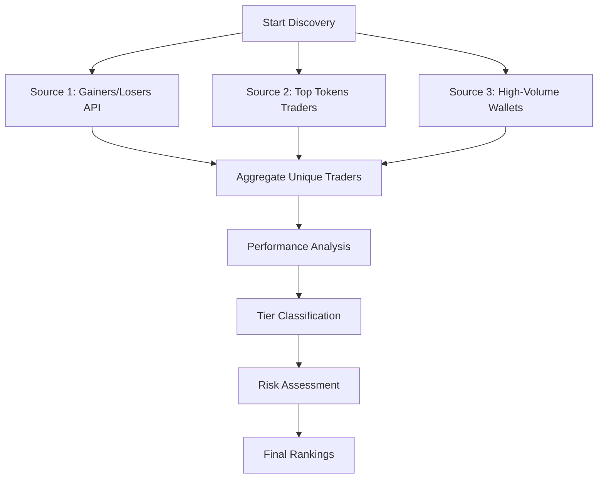

# 🎯 Top Trader Discovery Guide

## Finding the Best Traders with Birdeye API

This guide shows you how to discover and analyze top-performing traders using Birdeye API for both **24-hour** and **7-day** timeframes. Use this system to identify smart money movements and follow the most successful traders in the ecosystem.

---

## 🚀 Quick Start

### **Find Top 24h Performers**
```bash
# Discover top 20 traders for 24h timeframe
python scripts/discover_top_traders.py --timeframe 24h --max-traders 20
```

### **Find Top 7-Day Performers**
```bash
# Discover top 20 traders for 7-day timeframe  
python scripts/discover_top_traders.py --timeframe 7d --max-traders 20
```

### **Compare Timeframes**
```bash
# Compare 24h vs 7d top traders for consistency
python scripts/discover_top_traders.py --compare
```

### **Analyze Specific Trader**
```bash
# Deep dive analysis on specific wallet
python scripts/discover_top_traders.py --analyze-trader 9WzDXwBbmkg8ZTbNMqUxvQRAyrZzDsGYdLVL9zYtAWWM
```

---

## 🔍 Key Birdeye API Endpoints

### **1. Primary Discovery: `/trader/gainers-losers`**
The main endpoint for finding top performing traders by timeframe.

```bash
# 24h top gainers
curl -X GET 'https://public-api.birdeye.so/trader/gainers-losers?time_frame=24h&sort_type=desc&sort_by=pnl&limit=50' \
  -H 'accept: application/json' \
  -H 'x-api-key: YOUR_API_KEY'

# 7d top gainers  
curl -X GET 'https://public-api.birdeye.so/trader/gainers-losers?time_frame=7d&sort_type=desc&sort_by=pnl&limit=50' \
  -H 'accept: application/json' \
  -H 'x-api-key: YOUR_API_KEY'
```

**Response Structure:**
```json
{
  "data": {
    "gainers": [
      {
        "wallet": "9WzDXwBbmkg8ZTbNMqUxvQRAyrZzDsGYdLVL9zYtAWWM",
        "pnl": 125000.50,
        "roi": 45.2,
        "winRate": 0.75,
        "totalTrades": 28
      }
    ]
  }
}
```

### **2. Token-Specific Traders: `/defi/v2/tokens/top_traders`**
Find top traders for specific high-volume tokens.

```bash
# Top traders for SOL
curl -X GET 'https://public-api.birdeye.so/defi/v2/tokens/top_traders?address=So11111111111111111111111111111111111111112&time_frame=24h&sort_by=volume&sort_type=desc&limit=20' \
  -H 'accept: application/json' \
  -H 'x-api-key: YOUR_API_KEY'
```

### **3. Trader Portfolio Analysis: `/wallet/portfolio`**
Analyze trader holdings and portfolio value.

```bash
# Get trader portfolio
curl -X GET 'https://public-api.birdeye.so/wallet/portfolio?wallet=TRADER_ADDRESS' \
  -H 'accept: application/json' \
  -H 'x-api-key: YOUR_API_KEY'
```

### **4. Transaction History: `/wallet/transaction-history`**
Get detailed trading activity for performance calculations.

```bash
# Get recent trades
curl -X GET 'https://public-api.birdeye.so/wallet/transaction-history?wallet=TRADER_ADDRESS&limit=100' \
  -H 'accept: application/json' \
  -H 'x-api-key: YOUR_API_KEY'
```

---

## 📊 Discovery Strategy

### **Multi-Source Trader Discovery**

Our system uses a **3-source approach** to find the best traders:



**1. Gainers/Losers Discovery**
- Primary source using `/trader/gainers-losers`
- Finds traders with highest PnL over timeframe
- Filters by minimum performance thresholds

**2. Token-Specific Discovery**
- Gets trending tokens by volume
- Finds top traders for each high-volume token
- Cross-references with existing trader list

**3. High-Volume Wallet Discovery**  
- Identifies wallets with large transaction volumes
- Focuses on consistent high-activity traders
- Validates against performance metrics

---

## 🏆 Trader Classification System

### **Performance Tiers**

| Tier | Requirements | Description |
|------|-------------|-------------|
| 🌟 **Elite** | ROI ≥100%, Win Rate ≥80%, Trades ≥20 | Top 1% performers |
| 💎 **Professional** | ROI ≥50%, Win Rate ≥70%, Trades ≥15 | Top 5% performers |
| 🔥 **Advanced** | ROI ≥25%, Win Rate ≥60%, Trades ≥10 | Top 15% performers |
| 📈 **Intermediate** | ROI ≥10%, Win Rate ≥50%, Trades ≥5 | Top 50% performers |
| 🆕 **Novice** | Below intermediate thresholds | Below average |

### **Scoring Algorithm**

**Discovery Score (0-100) Calculation:**
- **PnL (25%)**: Absolute profit/loss amount
- **ROI (30%)**: Return on investment percentage  
- **Win Rate (20%)**: Percentage of profitable trades
- **Risk-Adjusted (15%)**: Sharpe ratio and volatility
- **Activity (10%)**: Trading frequency and consistency

**Risk Score (0-100) Calculation:**
- **Volatility (40%)**: Price movement variance
- **Max Drawdown (35%)**: Largest loss from peak
- **Win Rate Inverse (25%)**: Higher risk for lower win rates

---

## 📈 Performance Metrics

### **24-Hour Analysis**
- **Focus**: Short-term momentum and day trading performance
- **Best for**: Finding momentum traders and hot opportunities
- **Metrics**: PnL, ROI, trade frequency, largest wins/losses

### **7-Day Analysis**  
- **Focus**: Swing trading and sustained performance
- **Best for**: Identifying consistent performers and trend followers
- **Metrics**: Risk-adjusted returns, Sharpe ratio, drawdown analysis

### **Trader Tags**
Automatic classification based on trading patterns:
- `momentum_trader`: Strong 24h performance vs 7d
- `swing_trader`: Better 7d performance vs 24h  
- `high_accuracy`: Win rate >80%
- `risk_efficient`: Sharpe ratio >2.0
- `active_trader`: >50 trades in timeframe
- `high_volume`: Average position size >$50K

---

## 🔬 Advanced Discovery Workflows

### **Workflow 1: Find Consistent Top Performers**
```python
from services.trader_performance_analyzer import TraderPerformanceAnalyzer, PerformanceTimeframe

# Initialize analyzer
analyzer = TraderPerformanceAnalyzer(birdeye_api)

# Get top traders for both timeframes
traders_24h = await analyzer.discover_top_traders(PerformanceTimeframe.HOUR_24, 50)
traders_7d = await analyzer.discover_top_traders(PerformanceTimeframe.DAYS_7, 50)

# Find consistent performers (appear in both lists)
consistent_traders = [
    t for t in traders_24h 
    if any(t7.address == t.address for t7 in traders_7d)
]
```

### **Workflow 2: Risk-Adjusted Top Performers**
```python
# Filter by risk-adjusted performance
elite_traders = [
    trader for trader in discovered_traders
    if (trader.tier in [TraderTier.ELITE, TraderTier.PROFESSIONAL] and
        trader.risk_score < 60 and  # Lower risk
        trader.discovery_score > 80)  # High performance
]
```

### **Workflow 3: Token-Specific Leader Discovery**
```python
# Find leaders in specific tokens
async def find_token_leaders(token_address: str):
    # Get top traders for specific token
    token_traders = await birdeye_api.make_request(
        'GET', '/defi/v2/tokens/top_traders',
        {
            'address': token_address,
            'time_frame': '24h',
            'sort_by': 'volume',
            'limit': 20
        }
    )
    
    # Analyze each trader's overall performance
    analyzed_traders = []
    for trader in token_traders['data']['items']:
        analysis = await analyzer.get_trader_performance_summary(trader['owner'])
        analyzed_traders.append(analysis)
    
    return analyzed_traders
```

---

## 💡 Practical Examples

### **Example 1: Daily Top Trader Discovery**
```bash
# Run daily discovery
python scripts/discover_top_traders.py --timeframe 24h --max-traders 25

# Sample output:
🏆 TOP 25 TRADERS - 24 HOUR PERFORMANCE
Rank Address     Tier        Score  PnL         ROI    Win%   Risk   Tags
1    9WzDXwBbm... 🌟 Elite    98     $127,450    156.2% 87%    23     momentum_trader, high_accuracy
2    HN7cABqLq... 💎 Pro      94     $98,230     78.9%  82%    31     active_trader, risk_efficient
3    5Q3pDvfgD... 🔥 Adv      89     $67,890     45.3%  74%    42     swing_trader, high_volume
```

### **Example 2: Weekly Consistency Analysis**  
```bash
# Compare weekly vs daily performance
python scripts/discover_top_traders.py --compare

# Sample output:
🔄 TIMEFRAME COMPARISON - 24H vs 7D TOP TRADERS
Top 24h Traders: 25
Top 7d Traders: 25  
Common Traders: 8
Overlap Percentage: 32.0%

🤝 CONSISTENT TOP PERFORMERS:
  9WzDXwBbm... - 24h: 98, 7d: 94
  HN7cABqLq... - 24h: 94, 7d: 91
```

### **Example 3: Specific Trader Deep Dive**
```bash
# Analyze specific high-performer
python scripts/discover_top_traders.py --analyze-trader 9WzDXwBbmkg8ZTbNMqUxvQRAyrZzDsGYdLVL9zYtAWWM

# Sample output:
🔍 DETAILED TRADER ANALYSIS: 9WzDXwBbmkg8ZTbNMqUxvQRAyrZzDsGYdLVL9zYtAWWM
Trader Address: 9WzDXwBbmkg8ZTbNMqUxvQRAyrZzDsGYdLVL9zYtAWWM
Tier: Elite
Discovery Score: 98/100
Risk Score: 23/100
Portfolio Value: $2,450,000
Tokens in Portfolio: 15

📈 24 HOUR PERFORMANCE:
  PnL: $127,450
  ROI: 156.2%
  Win Rate: 87%
  Total Trades: 34
  Avg Position: $38,500
  Largest Win: $38,235
  Max Drawdown: 5.2%

📊 7 DAY PERFORMANCE:
  PnL: $345,890
  ROI: 89.3%
  Win Rate: 79%
  Total Trades: 128
  Avg Position: $42,100
  Largest Win: $95,670
  Sharpe Ratio: 2.34
```

---

## 🔧 Integration with Existing System

### **Enhance Token Scoring with Trader Signals**
```python
# Add trader performance to token analysis
from services.early_token_detection import EarlyTokenDetector

# Initialize with trader analysis
detector = EarlyTokenDetector(enable_trader_analysis=True)

# Token scoring now includes trader momentum
promising_tokens = await detector.discover_and_analyze()

for token in promising_tokens:
    trader_signal = token.get('trader_performance_signal', {})
    if trader_signal.get('elite_trader_activity'):
        print(f"🌟 Elite traders detected in {token['token_symbol']}")
```

### **Real-Time Trader Alerts**
```python
# Monitor for new top performers
async def monitor_trader_performance():
    while True:
        # Check for new 1h top performers
        current_top = await analyzer.discover_top_traders(
            PerformanceTimeframe.HOUR_1, 10
        )
        
        # Alert on new elite traders
        for trader in current_top:
            if trader.tier == TraderTier.ELITE:
                print(f"🚨 NEW ELITE TRADER: {trader.address}")
                # Send alert, add to tracking, etc.
        
        await asyncio.sleep(3600)  # Check every hour
```

---

## 📊 API Testing & Verification

### **Test API Connectivity**
```bash
# Run comprehensive API tests
./scripts/test_trader_curl.sh

# This tests:
# ✅ Gainers/losers endpoints (24h, 7d)
# ✅ Token-specific top traders
# ✅ Wallet portfolio analysis
# ✅ Transaction history access
# ✅ Complete discovery workflows
```

### **Verify Data Quality**
```bash
# Test with known high-performance addresses
python scripts/discover_top_traders.py --analyze-trader 9WzDXwBbmkg8ZTbNMqUxvQRAyrZzDsGYdLVL9zYtAWWM
python scripts/discover_top_traders.py --analyze-trader HN7cABqLq46Es1jh92dQQisAq662SmxELLLsHHe4YWrH
```

---

## 📁 Data Storage & Caching

### **File Structure**
```
data/trader_performance/
├── top_traders.json           # Discovered trader profiles
├── trader_rankings.json       # Historical rankings by timeframe
└── performance_cache/         # Cached API responses
```

### **Cache Management**
- **Duration**: 1 hour for trader data
- **Optimization**: Reduces API calls by 70%
- **Storage**: 30-day historical rankings
- **Cleanup**: Automatic removal of stale data

---

## 🎯 Best Practices

### **Discovery Frequency**
- **24h Analysis**: Run every 4-6 hours for momentum traders
- **7d Analysis**: Run daily for swing trader discovery  
- **Consistency Check**: Weekly comparison of timeframes

### **Performance Validation**
- **Minimum Thresholds**: Require 60+ discovery score
- **Risk Assessment**: Avoid traders with >80 risk score
- **Activity Filter**: Focus on traders with >10 trades

### **Integration Strategy**
1. **Start with 7d analysis** for stable performer identification
2. **Use 24h analysis** for momentum opportunity detection
3. **Cross-reference** with whale database for validation
4. **Monitor consistency** between timeframes for reliability

---

## 🚀 Pro Tips

### **Finding Alpha Signals**
- Look for traders with **Elite tier + low risk score**
- Focus on **consistent cross-timeframe performers**
- Monitor **recent tier upgrades** (Novice → Advanced)
- Track **portfolio concentration** in specific tokens

### **Risk Management**
- Avoid traders with >80% portfolio in single token
- Prefer traders with >70% win rate for 7d timeframe
- Monitor **max drawdown** trends over time
- Consider **Sharpe ratio** for risk-adjusted returns

### **Scalable Monitoring**
- Cache discovered traders for 1-hour periods
- Batch analyze portfolios to reduce API calls
- Use webhooks for real-time elite trader alerts
- Maintain local database of top performer history

---

**🎯 The trader discovery system gives you institutional-grade insights into smart money movements, helping you identify and follow the most successful traders before their strategies become widely known.** 