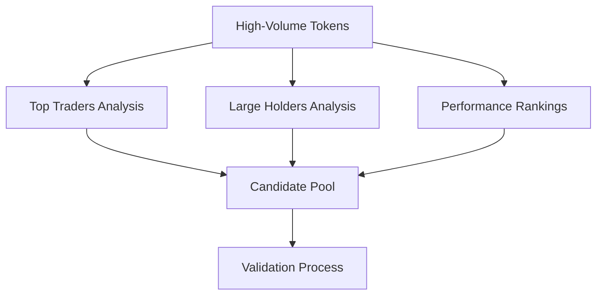

# 🐋 Whale Discovery & Tracking System

## Overview

The Whale Discovery System automatically identifies and tracks successful whale wallets using Birdeye API to enhance early token detection with advanced alpha generation signals.

## 🎯 Core Features

### **1. Dynamic Whale Discovery**
- **Multi-Source Analysis**: Analyzes top traders, large holders, and performance data
- **Automated Validation**: Validates wallets based on success rate, position size, and trading activity
- **Tiered Classification**: Classifies whales into 3 tiers based on position sizes
- **Real-time Updates**: Continuously discovers and validates new whale wallets

### **2. Whale Activity Analysis**
- **Accumulation Detection**: Identifies whale accumulation patterns (+15 to +25 bonus)
- **Distribution Warnings**: Detects whale distribution patterns (-10 to -20 penalty)
- **Institutional Flow Tracking**: Monitors institutional-scale movements
- **Smart Money Timing**: Analyzes early entry patterns from proven performers

### **3. Advanced Scoring Impact**
- **Grade A+ (20-25 points)**: Institutional flows and coordinated whale activity
- **Grade A (15-20 points)**: Strong whale accumulation and smart money entry
- **Grade B+ (10-15 points)**: Individual whale accumulation
- **Grade B (5-10 points)**: Moderate whale activity

## 🔗 Birdeye API Endpoints for Whale Discovery

### **Essential Curl Commands**

#### 1. **Top Traders Analysis**
```bash
curl -X GET "https://public-api.birdeye.so/defi/v2/tokens/top_traders?address=TOKEN_ADDRESS" \
  -H "x-chain: solana" \
  -H "X-API-KEY: YOUR_API_KEY"
```

#### 2. **Large Holder Discovery**
```bash
curl -X GET "https://public-api.birdeye.so/defi/token_holder?address=TOKEN_ADDRESS" \
  -H "x-chain: solana" \
  -H "X-API-KEY: YOUR_API_KEY"
```

#### 3. **Performance-Based Discovery**
```bash
curl -X GET "https://public-api.birdeye.so/defi/v2/trader_gainers_losers?type=gainers&offset=0&limit=10" \
  -H "x-chain: solana" \
  -H "X-API-KEY: YOUR_API_KEY"
```

#### 4. **Wallet Validation**
```bash
curl -X GET "https://public-api.birdeye.so/defi/wallet_portfolio?wallet=WALLET_ADDRESS" \
  -H "x-chain: solana" \
  -H "X-API-KEY: YOUR_API_KEY"
```

#### 5. **High-Volume Token Selection**
```bash
curl -X GET "https://public-api.birdeye.so/defi/v3/token/list?sort_by=volume_24h_usd&sort_type=desc&min_liquidity=1000000&limit=20" \
  -H "x-chain: solana" \
  -H "X-API-KEY: YOUR_API_KEY"
```

#### 6. **Trading History Analysis**
```bash
curl -X POST "https://public-api.birdeye.so/defi/v3/all-time/trades/multiple" \
  -H "x-chain: solana" \
  -H "X-API-KEY: YOUR_API_KEY" \
  -H "Content-Type: application/json" \
  -d '{"time_frame": "24h", "list_address": "TOKEN1,TOKEN2,TOKEN3"}'
```

## 🚀 Whale Discovery Strategy

### **Phase 1: Token Selection**
1. **High-Volume Tokens**: Select tokens with $5M+ 24h volume
2. **Liquidity Threshold**: Minimum $1M liquidity for analysis
3. **Recent Activity**: Focus on tokens with recent trading activity

### **Phase 2: Candidate Discovery**


### **Phase 3: Validation Criteria**
- **Success Rate**: ≥60% win rate required
- **Total PnL**: ≥$500K total profits
- **Diversification**: ≥5 different tokens traded
- **Position Size**: ≥$1M average position size
- **Confidence Score**: ≥70% confidence rating

### **Phase 4: Tier Classification**
- **Tier 1 (Mega Whales)**: $50M+ average positions
- **Tier 2 (Large Whales)**: $10M-$50M positions
- **Tier 3 (Medium Whales)**: $1M-$10M positions

## 📊 Whale Activity Detection Algorithms

### **1. Large Holder Accumulation**
- Analyzes top 20 holders for known whales
- Calculates position values and accumulation strength
- Triggers on multiple whale presence (2+ whales)

### **2. Trading Pattern Analysis**
- Monitors top 15 traders for whale activity
- Combines whale presence with trading volume
- Focuses on known successful whale traders

### **3. Institutional Flow Detection**
- Identifies institutional-scale activity patterns
- Analyzes average trade sizes and trader distribution
- Detects flows ≥$5M with optimal trader counts

### **4. Smart Money Timing**
- Tracks early whale entry (1-72 hours after launch)
- Identifies known early-adopter whales
- Awards timing bonuses for early positioning

### **5. Coordinated Activity**
- Detects multiple whales (3+) acting together
- Analyzes coordination across holders and traders
- Combines whale quality metrics for scoring

## 🛠️ Implementation Guide

### **Setup and Configuration**

1. **Install Dependencies**
```bash
pip install -r requirements.txt
```

2. **Configure API Key**
```bash
export BIRDEYE_API_KEY="your_api_key_here"
```

3. **Test API Connectivity**
```bash
chmod +x scripts/test_whale_curl.sh
./scripts/test_whale_curl.sh
```

### **Running Whale Discovery**

#### **Automated Discovery**
```bash
python scripts/discover_whales.py
```

#### **Integration with Token Detection**
```python
from services.whale_discovery_service import WhaleDiscoveryService
from services.whale_activity_analyzer import WhaleActivityAnalyzer

# Initialize services
discovery_service = WhaleDiscoveryService(birdeye_api)
whale_analyzer = WhaleActivityAnalyzer(logger, discovery_service)

# Discover new whales
new_whales = await discovery_service.discover_new_whales(max_discoveries=50)

# Use in token analysis
whale_signal = await whale_analyzer.analyze_whale_activity(token_address, token_data)
```

### **Database Management**

The system maintains a persistent whale database at `data/whale_database.json`:

```json
{
  "wallet_address": {
    "address": "9WzDXwBbmkg8ZTbNMqUxvQRAyrZzDsGYdLVL9zYtAWWM",
    "tier": 1,
    "name": "Discovered Whale 9WzDXwBb",
    "avg_position": 50000000,
    "success_rate": 0.75,
    "known_for": "institutional_holdings",
    "total_pnl": 2500000,
    "tokens_traded": 25,
    "confidence_score": 0.85
  }
}
```

## 📈 Scoring Impact Examples

### **High-Impact Scenarios (+20 to +25 points)**
- **Institutional Flow**: 4+ Tier 1 whales with $5M+ combined activity
- **Coordinated Accumulation**: Multiple whales accumulating simultaneously
- **Early Smart Money**: Known early-adopters entering within 24h of launch

### **Strong Signals (+15 to +20 points)**
- **Whale Coordination**: 3+ whales with high success rates
- **Smart Money Entry**: Proven performers entering early
- **Large Accumulation**: Individual mega-whale accumulation

### **Moderate Signals (+10 to +15 points)**
- **Individual Whale Activity**: Single whale accumulation
- **Medium Whale Coordination**: Tier 2/3 whales coordinating
- **Stealth Accumulation**: Gradual whale positioning

### **Warning Signals (-10 to -20 points)**
- **Distribution Patterns**: Whales selling/exiting positions
- **Coordinated Exits**: Multiple whales reducing positions
- **Smart Money Exit**: Known performers leaving

## 🔍 Advanced Features

### **Real-Time Monitoring**
- Continuous whale database updates
- Activity pattern recognition
- Early warning systems for distribution

### **Performance Tracking**
- Success rate monitoring
- Position size tracking
- Trading style analysis

### **Integration Benefits**
- Enhanced early token detection
- Improved alpha generation
- Risk management through whale monitoring
- Institutional interest tracking

## 🎯 Best Practices

### **API Usage**
- Implement proper rate limiting (0.5-1s between calls)
- Use batch endpoints when available
- Cache results to minimize API calls
- Monitor API quotas and limits

### **Whale Validation**
- Cross-reference multiple data sources
- Validate with portfolio analysis
- Monitor success rates over time
- Update profiles regularly

### **Risk Management**
- Monitor for whale distribution
- Track position changes
- Identify coordinated exits
- Use confidence scores for filtering

## 📊 Performance Metrics

The system provides comprehensive statistics:

```python
stats = discovery_service.get_discovery_stats()
# Returns: {
#   'total_whales': 150,
#   'tier_distribution': {1: 25, 2: 45, 3: 80},
#   'avg_success_rate': 0.72,
#   'avg_confidence_score': 0.78,
#   'database_file': 'data/whale_database.json'
# }
```

## 🚨 Important Notes

### **Rate Limiting**
- Birdeye API has rate limits
- Implement delays between requests
- Use batch endpoints efficiently
- Monitor API quotas

### **Data Quality**
- Validate all whale data
- Cross-reference multiple sources
- Update profiles regularly
- Filter by confidence scores

### **Compliance**
- Respect API terms of service
- Implement proper error handling
- Log all discovery activities
- Maintain data privacy

## 🔮 Future Enhancements

- **Machine Learning Models**: Pattern recognition for whale behavior
- **Real-Time Alerts**: Immediate notifications for whale activity
- **Cross-Chain Analysis**: Expand beyond Solana
- **Social Sentiment**: Integrate whale social media activity
- **Predictive Analytics**: Forecast whale movements

---

*The Whale Discovery System provides institutional-grade whale tracking that gives you a significant edge in alpha generation through early detection of smart money movements before retail awareness.* 