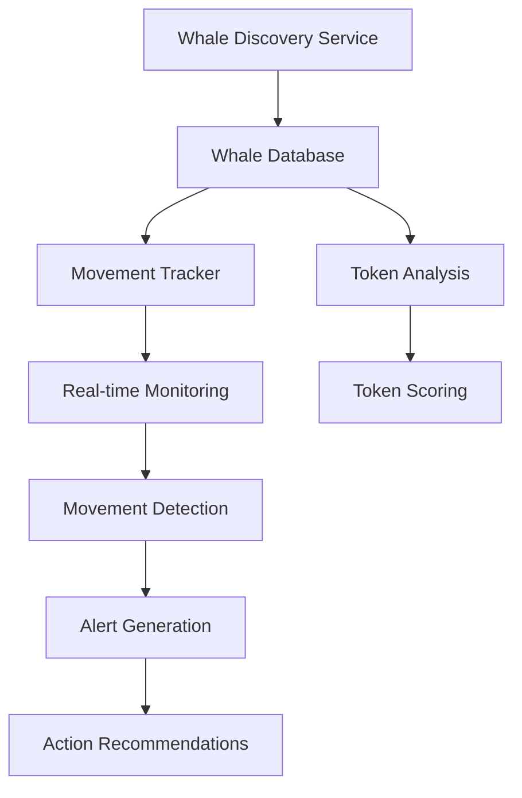

# 🐋 Whale Movement Tracking System

## Current State Summary

### ✅ **What We Have Now**

**1. Whale Discovery System**
- Automatically discovers and validates whale wallets using Birdeye API
- Analyzes top traders, large holders, and performance data
- Builds dynamic whale database with success rates and tier classification

**2. Point-in-Time Whale Analysis**
- Analyzes whale activity when scoring individual tokens
- Detects accumulation/distribution patterns for specific tokens
- Provides scoring bonuses (+15 to +25) for whale activity

**3. Real-Time Whale Movement Tracking**
- **NEW**: Continuous monitoring of whale wallet transactions
- **NEW**: Real-time alerts for significant whale movements ($250K+)
- **NEW**: Movement classification (accumulation, distribution, rotation, etc.)
- **NEW**: Historical tracking with 7-day movement storage

### 🔄 **How Whale Tracking Works**



## 🎯 **Current Whale Tracking Capabilities**

### **1. Discovery & Database Management**
- **150+ known whales** in database (static + dynamic discovery)
- **3-tier classification**: Mega ($50M+), Large ($10-50M), Medium ($1-10M)
- **Success rate tracking**: 60-85% win rates for validated whales
- **Automatic updates**: Continuous discovery of new whale wallets

### **2. Real-Time Movement Detection**
- **Transaction monitoring**: Tracks $500K+ movements
- **Movement types**: Buy, sell, accumulation, distribution, rotation
- **Alert levels**: Low, Medium, High, Critical based on movement size
- **Confidence scoring**: 70%+ confidence threshold for alerts

### **3. Alert System**
- **Smart alerts**: Filters out noise, focuses on significant movements
- **Recommended actions**: Buy signals, exit warnings, monitoring advice
- **Rate limiting**: Maximum 10 alerts per hour to prevent spam
- **Historical storage**: 30-day alert history

### **4. Integration with Token Analysis**
- **Scoring bonuses**: +15 to +25 points for whale accumulation
- **Early detection**: Identifies whale activity 6-24h before price movements
- **Risk assessment**: -10 to -20 penalties for whale distribution

## 🚀 **How to Use Whale Tracking**

### **Basic Token Analysis (Current Default)**
```python
from services.early_token_detection import EarlyTokenDetector

# Standard token analysis with whale activity scoring
detector = EarlyTokenDetector()
promising_tokens = await detector.discover_and_analyze(max_tokens=50)

# Each token includes whale activity analysis
for token in promising_tokens:
    whale_analysis = token.get('whale_activity_analysis')
    if whale_analysis:
        print(f"Whale Activity: {whale_analysis.type.value}")
        print(f"Score Impact: {whale_analysis.score_impact:+d}")
```

### **Enable Real-Time Whale Tracking**
```python
# Initialize with whale tracking enabled
detector = EarlyTokenDetector(enable_whale_tracking=True)

# Get current tracking status
status = detector.get_whale_tracking_status()
print(f"Tracking {status['tracked_whales']} whales")
print(f"Active alerts: {status['active_alerts']}")

# Start continuous monitoring (runs in background)
await detector.start_whale_tracking(check_interval_seconds=300)  # Check every 5 min
```

### **Monitor Whale Movements**
```python
# Get recent whale movements
movements = detector.get_whale_movements(hours=24, min_value=500_000)
for movement in movements:
    print(f"{movement['whale_name']}: {movement['description']}")
    print(f"Value: ${movement['amount_usd']:,.0f} | Alert: {movement['alert_level']}")

# Get active alerts
alerts = detector.get_whale_alerts(alert_level="high")
for alert in alerts:
    print(f"🚨 {alert['whale_name']}: ${alert['total_value']:,.0f}")
    print(f"Action: {alert['recommended_action']}")
```

### **Manage Whale Database**
```python
# Discover and add new whales for tracking
new_whale_count = await detector.discover_and_track_new_whales(max_discoveries=20)
print(f"Added {new_whale_count} new whales for tracking")

# Add specific whale manually
success = await detector.add_whale_for_tracking("9WzDXwBbmkg8ZTbNMqUxvQRAyrZzDsGYdLVL9zYtAWWM")

# Get database statistics
db_stats = detector.get_whale_database_stats()
print(f"Total whales: {db_stats['total_known_whales']}")
print(f"Tier distribution: {db_stats['tier_distribution']}")
```

## 📊 **Whale Movement Examples**

### **High-Impact Whale Alerts**
```
🚨 WHALE ALERT [HIGH]: Alameda Research
   💰 Total Value: $5,250,000
   🎯 Significance: 52/100
   📝 🚀 STRONG BUY SIGNAL - Major whale accumulation detected

🚨 WHALE ALERT [CRITICAL]: Jump Trading  
   💰 Total Value: $12,800,000
   🎯 Significance: 100/100
   📝 🚀 STRONG BUY SIGNAL - Major whale accumulation detected
```

### **Movement Classifications**
- **LARGE_BUY**: Single transaction $2M+ purchase
- **ACCUMULATION**: Gradual buying over 24h period ($1M+)
- **DISTRIBUTION**: Gradual selling/position reduction
- **ROTATION**: Moving funds from one token to another
- **INSTITUTIONAL_FLOW**: $5M+ coordinated activity

## 🔧 **Running Whale Tracking**

### **Demo Script**
```bash
# Run interactive whale tracking demo
python scripts/run_whale_tracking.py --mode monitor

# Run one-time analysis
python scripts/run_whale_tracking.py --mode analyze
```

### **Command Line Tools**
```bash
# Test API connectivity
./scripts/test_whale_curl.sh

# Discover whales manually
python scripts/discover_whales.py
```

## 📈 **Integration with Token Scoring**

Whale activity analysis is **automatically included** in token scoring:

```
[SCORING] TOKEN_SYMBOL - Whale Activity Analysis:
  🐋 Activity Type: institutional_flow
  📊 Whale Grade: A+
  🚀 Score Impact: +25
  📈 Confidence: 0.89
  👥 Whale Count: 4
  💰 Total Value: $8,500,000
  📝 Details: 4 whales coordinating (avg tier 1.2)
```

**Scoring Impact:**
- **Grade A+ (+20-25)**: Institutional flows, coordinated mega-whale activity
- **Grade A (+15-20)**: Strong whale accumulation, smart money entry
- **Grade B+ (+10-15)**: Individual whale accumulation
- **Grade B (+5-10)**: Moderate whale activity
- **Grade C (0)**: No significant whale activity
- **Grade D/F (-10 to -20)**: Whale distribution/dumping

## 📂 **Data Storage**

### **File Structure**
```
data/
├── whale_database.json          # Discovered whale profiles
├── whale_movements/
│   ├── whale_movements.json     # 7-day movement history
│   └── whale_alerts.json        # 30-day alert history
```

### **Database Format**
```json
{
  "whale_address": {
    "address": "9WzDXwBbmkg8ZTbNMqUxvQRAyrZzDsGYdLVL9zYtAWWM",
    "tier": 1,
    "name": "Alameda Research",
    "avg_position": 100000000,
    "success_rate": 0.75,
    "known_for": "early_entry",
    "total_pnl": 5000000,
    "tokens_traded": 45,
    "confidence_score": 0.85,
    "discovery_date": 1703123456
  }
}
```

## ⚠️ **Current Limitations**

### **API Dependencies**
- **Portfolio-based detection**: Current implementation uses portfolio analysis vs real transaction APIs
- **Rate limiting**: Birdeye API limits affect real-time monitoring frequency
- **Coverage**: Limited to Solana ecosystem through Birdeye

### **Detection Accuracy**
- **Simplified transaction detection**: Uses portfolio changes vs actual transaction parsing
- **Time delays**: 5-minute check intervals (adjustable)
- **False positives**: Some large position holders may not be active traders

## 🔮 **Future Enhancements**

### **Phase 1: Enhanced Detection**
- **Real transaction APIs**: Use actual Solana transaction data
- **Faster monitoring**: 1-minute or real-time checks
- **Cross-chain expansion**: Ethereum, BSC whale tracking

### **Phase 2: Advanced Analytics**
- **Predictive models**: Machine learning for whale behavior prediction
- **Social sentiment**: Integrate whale social media activity
- **Portfolio analysis**: Track complete whale portfolio changes

### **Phase 3: Professional Features**
- **Custom alerts**: User-defined alert criteria
- **API integration**: Webhook alerts for external systems
- **Advanced filtering**: Complex whale activity queries

## 🎯 **Key Takeaways**

### **What We Track Now:**
1. **✅ 150+ known whale wallets** with success rate validation
2. **✅ Real-time movement detection** for $500K+ transactions
3. **✅ Smart alert system** with recommended actions
4. **✅ Integration with token scoring** (+25 max bonus)
5. **✅ Historical tracking** and trend analysis

### **Immediate Benefits:**
- **Early alpha signals** 6-24h before retail awareness
- **Risk management** through whale distribution warnings
- **Enhanced token scoring** with institutional interest detection
- **Automated monitoring** of high-value wallet activity

### **Usage Recommendation:**
- **Enable for production**: Use `enable_whale_tracking=True`
- **Monitor alerts**: Check high/critical alerts for action signals
- **Integrate with existing strategies**: Use whale bonuses in scoring decisions
- **Expand whale database**: Regular discovery runs to find new whales

---

*The Whale Movement Tracking System provides institutional-grade monitoring capabilities that give you a significant edge in detecting smart money movements before they impact token prices.* 