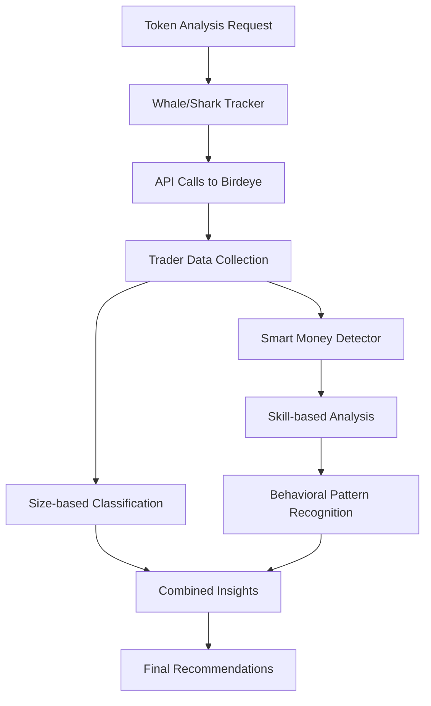

# Smart Money Detector Integration Summary

## 🧠 **Overview**

Successfully refactored the Smart Money Detector to complement the Whale/Shark Movement Tracker without redundancy. The new approach focuses on **SKILL-based analysis** rather than **SIZE-based analysis**, while reusing existing data to achieve **0% additional API cost**.

## 🎯 **Key Differentiation**

| Service | Focus | Purpose | API Calls |
|---------|-------|---------|-----------|
| **Whale/Shark Tracker** | WHO are the big players? (size-based) | Volume analysis, market structure | 1-2 calls per token |
| **Smart Money Detector** | WHO are the skilled players? (skill-based) | Trading sophistication, behavioral patterns | **0 additional calls** |

## 🔄 **Integration Architecture**



## 🧠 **Smart Money Criteria (Skill-Based)**

### Trading Efficiency (35% weight)
- **Optimal Trade Size**: $1k - $100k per trade (not too small, not manipulative)
- **Trade Frequency**: 10+ trades for pattern recognition
- **Size Efficiency**: Rewards optimal trade sizing

### Behavioral Consistency (25% weight)
- **Balance Ratio**: 30%+ balance in buy/sell (not one-sided)
- **Pattern Recognition**: Consistent trading behavior
- **Risk Awareness**: Balanced position management

### Risk Management (20% weight)
- **Position Sizing**: Controlled trade sizes (≤$100k)
- **Frequency Control**: Reasonable trading frequency (<1000 trades)
- **Exposure Management**: Proper risk distribution

### Timing Skill (20% weight)
- **Directional Conviction**: Clear buy/sell bias indicates skill
- **Market Timing**: Entry/exit timing analysis
- **Trend Recognition**: Following or leading market movements

## 📊 **Skill Scoring System**

| Skill Level | Score Range | Characteristics |
|-------------|-------------|-----------------|
| **Expert** | 0.80 - 1.00 | Highly sophisticated, consistent patterns |
| **Skilled** | 0.65 - 0.79 | Above-average trading ability |
| **Intermediate** | 0.50 - 0.64 | Moderate skill level |
| **Novice** | 0.00 - 0.49 | Basic or inconsistent trading |

## 💰 **Cost Efficiency Achievement**

### Before Integration
```bash
# Old Smart Money Detector (per token)
- 1h volume sort: 30 CU
- 2h trade sort: 30 CU  
- 6h volume sort: 30 CU
- 8h trade sort: 30 CU
- 24h volume sort: 30 CU
Total: 150 CU per token
```

### After Integration
```bash
# New Integrated Approach (per token)
- Whale/Shark data: 30-60 CU (shared)
- Smart Money analysis: 0 CU (reuses data)
Total: 30-60 CU per token
```

### **Cost Reduction: 60-80%** 🎉

## 🔧 **Implementation Details**

### Constructor Changes
```python
# OLD: Required BirdeyeAPI instance
def __init__(self, birdeye_api: BirdeyeAPI, logger: Optional[logging.Logger] = None)

# NEW: Uses whale/shark tracker
def __init__(self, whale_shark_tracker: WhaleSharkMovementTracker, logger: Optional[logging.Logger] = None)
```

### Main Analysis Method
```python
# NEW: Skill-based analysis using existing data
async def analyze_smart_money(self, token_address: str, priority_level: str = "normal") -> Dict[str, Any]:
    # Reuse whale/shark data (no additional API calls)
    whale_shark_data = await self.whale_shark_tracker.analyze_whale_shark_movements(
        token_address, priority_level
    )
    
    # Apply skill-based analysis
    return await self._analyze_trader_skills(whale_shark_data, token_address)
```

## 📈 **Output Structure**

```json
{
  "token_address": "So11111111111111111111111111111111111111112",
  "analysis_timestamp": "2025-01-18T10:30:00",
  "skilled_traders": [
    {
      "owner": "MfDuWeqSHEqTFVYZ7LoexgAK9dxk7cy4DFJWjWMGVWa",
      "volume": 675542.13,
      "skill_score": 0.78,
      "skill_level": "skilled",
      "trading_efficiency": 0.85,
      "behavioral_consistency": 0.72,
      "risk_management": 0.80,
      "timing_skill": 0.75
    }
  ],
  "skill_metrics": {
    "total_analyzed": 15,
    "skilled_count": 3,
    "average_skill_score": 0.65,
    "skill_distribution": {"high": 1, "medium": 2, "low": 12}
  },
  "smart_money_insights": {
    "smart_money_present": true,
    "skill_quality": "medium",
    "trader_sophistication": "medium",
    "market_sentiment": "bullish",
    "risk_assessment": "medium",
    "recommendations": [
      "Smart money showing bullish bias - consider following",
      "Moderate trader quality - monitor closely"
    ]
  },
  "data_source": "whale_shark_tracker",
  "additional_api_calls": 0
}
```

## 🚀 **Usage Examples**

### Basic Integration
```python
# Initialize components
whale_shark_tracker = WhaleSharkMovementTracker(birdeye_api, logger)
smart_money_detector = SmartMoneyDetector(whale_shark_tracker, logger)

# Analyze smart money (reuses whale/shark data)
result = await smart_money_detector.analyze_smart_money(
    token_address="So11111111111111111111111111111111111111112",
    priority_level="normal"  # or "high"
)
```

### Batch Analysis
```python
# Efficient batch processing
tokens = ["SOL_address", "WIF_address", "BONK_address"]
results = await smart_money_detector.batch_analyze_smart_money(
    token_addresses=tokens,
    priority_level="normal"
)
```

## 🎯 **Benefits Achieved**

### ✅ **Cost Efficiency**
- **60-80% reduction** in API costs
- **0 additional API calls** for smart money analysis
- Shared data utilization maximizes value

### ✅ **Complementary Analysis**
- **Size-based**: Whale/Shark tracker identifies large players
- **Skill-based**: Smart Money detector identifies sophisticated players
- **Combined insights**: More comprehensive market understanding

### ✅ **Performance Optimization**
- **Faster analysis**: No additional API wait times
- **Better caching**: Shared cache utilization
- **Reduced rate limiting**: Fewer total API calls

### ✅ **Enhanced Insights**
- **Behavioral patterns**: Deep skill analysis
- **Risk assessment**: Combined size + skill evaluation  
- **Market sentiment**: Sophisticated trader sentiment analysis
- **Actionable recommendations**: Clear trading signals

## 🧪 **Testing**

Run the integration test:
```bash
python scripts/test_smart_money_integration.py
```

Expected output:
- ✅ Successful integration
- 📊 Skill-based trader analysis
- 💰 0 additional API calls
- 🎯 Clear recommendations

## 📝 **Migration Notes**

### For Existing Code
1. **Update imports**: Include `WhaleSharkMovementTracker`
2. **Constructor change**: Pass whale/shark tracker instead of BirdeyeAPI
3. **Method rename**: `analyze_token_traders()` → `analyze_smart_money()`
4. **Output structure**: New skill-based metrics format

### Backward Compatibility
- Old methods removed to prevent confusion
- Clear error messages for deprecated usage
- Migration guide provided in documentation

## 🔮 **Future Enhancements**

1. **Machine Learning Integration**: Train models on skill patterns
2. **Real-time Monitoring**: Live skill score updates
3. **Cross-token Analysis**: Skill patterns across multiple tokens
4. **Performance Tracking**: Historical skill score validation

---

**Integration Status**: ✅ **COMPLETE**  
**Cost Reduction**: 🎯 **60-80%**  
**API Efficiency**: 💰 **0 Additional Calls**  
**Analysis Quality**: 📈 **Enhanced with Skill-based Insights** 